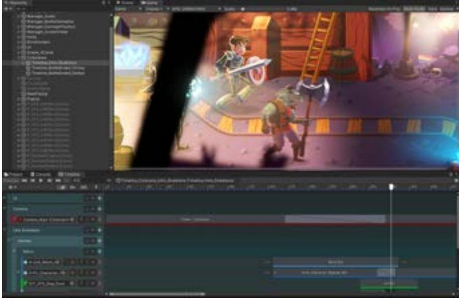

## UNITY FOR GAMES ⟶ E-BOOK

# T H E U N I T Y G A M E D E S I G N E R P L AY B O O K

## **Contents**

| Introduction. 4                               |
|-----------------------------------------------|
| Contributors. 5                               |
| Pitch your project. 6                         |
| Keep it simple and know your audience 6       |
| Understand the actual player 6                |
| Be brief and use visuals 7                    |
| Prepare your presentation 7                   |
| Test for marketability 9                      |
| Career progression 10                         |
| Narrative designer 11                         |
| Level designer 11                             |
| Gameplay designer 12                          |
| Game economy designer 12                      |
| Get started in Unity. 13                      |
| GameObjects 15                                |
| The Scene view 17                             |
| The Scene Gizmo 18                            |
| Package Manager 23                            |
| Prefabs: Reusable GameObjects 24              |
| A welcome window in the Inspector 32          |
| Adding your document links to the top bar 33  |
| Use assets and tools from the Asset Store. 34 |
| Top picks  35                                 |
| Importing assets into your project 36         |
| Create gameplay. 37                           |
| Visual scripting to create gameplay 37        |
| Working with a team on Scenes 42              |

| Modular gameplay systems 43                       |  |
|---------------------------------------------------|--|
| Input to control characters 45                    |  |
| The Input System 45                               |  |
| Set up your first character controller 49         |  |
| Create game flows with UI and Unity Events 58     |  |
| Put the UI to work: Unity Events 62               |  |
| Build game levels 66                              |  |
| Use the FBX Exporter for refining with artists 71 |  |
| Timing and animation 72                           |  |
| Camera design for gameplay 74                     |  |
| Cinemachine: A Virtual Camera system 75           |  |
| Creative ways to use Cinemachine 77               |  |
| Timeline 81                                       |  |
| Juice it up. 87                                   |  |
| Microinteractions 87                              |  |
| Randomization 89                                  |  |
| Animation Curves 92                               |  |
| Avoid linearity when lerping 94                   |  |
| The Particle System 95                            |  |
| Post-processing effects 97                        |  |
| Appendix: Share and playtest 98                   |  |
| Testing for performance and bugs 99               |  |
| Benchmarks tools 100                              |  |
| Share the game build 100                          |  |
| Share and back up your project 100                |  |
| Conclusion. 101                                   |  |
| How to get Unity 101                              |  |
| How to learn Unity 101                            |  |
| Discover Unity art creation tools. 102            |  |

## **Introduction**

The Unity Game Designer Playbook aims to inspire and instruct game designers who want to learn how to prototype, craft, and test gameplay in Unity. Whether you study game design, are starting out in your career, or have years of professional experience, you can reference this guide as you begin to add Unity skills to your profile.

Unity is the most widely used game development platform, so gaining Unity skills can open up new opportunities for you, even if you work on a team using another engine.

The contributors to this guide are game designers both within Unity and from our community. The content reflects their vibrant creativity, advanced expertise, and unique mix of skills and interests.

You'll find a broad, even eclectic, mix of detailed introductions to Unity tool sets, instructional sections that you can follow in your own project, and a wide variety of examples that illustrate how to create and juice up gameplay in Unity.

Some of the topics covered include Editor navigation and beginner C# scripting concepts, visual scripting, creating input, setting up character controllers, greyboxing and level-design tools, cinematics, microinteractions and randomization, special effects, and more.

The Unity ecosystem has a lot of assets and projects to kickstart your game design journey.

Not every section of the guide will appeal to every reader. Whether you read a few chapters or the complete guide, the intent is to welcome you to Unity and highlight the tools you can use to sharpen your creative focus, bring new skills and efficiency to your team, and build your portfolio.

Based on years of talking to individual creators and game studios, from indie to AAA, we know that when game designers create gameplay and design mechanics in Unity, they can demonstrate the vision for the game clearly and in greater detail to the rest of the team.

This benefits the entire production cycle by driving thorough testing of concepts and better informed decisions about which ideas will work – or not – in the final game.

Ultimately, when game designers can express their intent in rich, interactive detail, they can contribute to the project moving into full production faster.

## **Contributors**

Game designers at [Team17](https://blog.unity.com/games/unity-is-more-than-an-engine-for-team17?utm_source=demand-gen&utm_medium=pdf&utm_campaign=asset-links-gmg-artist-expansion&utm_content=game-designer-playbook-ebook) shared their experience creating games, such as *Overcooked!* and the *Worms* series, over several interviews. In addition to developing their own games, Team17's indie games label works with independent studios around the globe to help bring their games to market. You can follow their work on their [website](https://www.team17.com/).

Thomas at [noio.nl](http://www.noio.nl/), who recently published *[Cloud Gardens](https://store.steampowered.com/app/1372320/Cloud_Gardens/)*, contributed tips and best practices he's learned throughout his career.

[Christo Nobbs,](https://twitter.com/CH71ST0) a senior technical game designer who specializes in systems game design and Unity (C#). Christo has been using Unity since Unity 4. He considers himself an information sponge and a rapid prototyper. Christo worked previously as a technical game designer at PUBG/PlayerUnknown Productions.

#### **From Unity:**

[Eduardo Oriz,](https://twitter.com/EduOriz) a senior content marketing manager at Unity, led the production of the guide. Eduardo has many years of experience working with Unity development teams, such as the 2D tools team, and he has a broad understanding of what Unity offers to game developers and studios.

[Alex Kikuchi](https://twitter.com/1mbitshorde?s=20) has led advocacy projects in the Americas and worked closely with Unity's user community to understand their needs. Alex recently released his game, *[Spirit of the Island](https://store.steampowered.com/app/1592110/Spirit_of_the_Island/)*.

[Ciro Continisio,](https://twitter.com/CiroContns) a lead advocate, has over 12 years of development experience, including two commercial game releases with his own company, Tiny Colossus, and work as a tester at Electronic Arts.

Unity copywriters, editors, and graphic designers, as well as colleagues in the marketing organization all added their touches to this e-book. Thank you to all contributors!

## **Pitch your project**

The first step in a new project is to sell the idea to potential investors, studio heads, and fellow team members. The pitch is like the first "release" of your game. If you're new to pitching, here are some tips to help you prepare.

## Keep it simple and know your audience

A pitch is a concise introduction to the story. You will most likely need to present the project multiple times, so keep the outline of the pitch straightforward and easy to tailor to the interests and concerns of each audience you address.

Fine-tune your presentation for each audience using visuals and the key gameplay elements and hooks you demonstrate. What you show to programmers will be different than to investors. Expect a lot of questions, and be ready to demonstrate that you researched your market and audience thoroughly.

## Understand the actual player

The target audience for your game might not be you. Keep an open mind and research who your target players are and what types of games, music, films, and books are popular with them. Look at demographic and consumer trend reports. Read reviews of games similar to the one you're pitching, including comments on social media and YouTube. If possible, use analytics tools like Google Analytics or Facebook Ads to learn more about the potential size of your target demographic.

Don't hold back when it comes to appealing to your players' emotions and sense of fun in a game. The image on the left is from a modified version of the Unity [Karting Microgame.](https://learn.unity.com/project/karting-template?utm_source=demand-gen&utm_medium=pdf&utm_campaign=asset-links-gmg-artist-expansion&utm_content=game-designer-playbook-ebook)

## Be brief and use visuals

A pitch should not be a detailed game design document (GDD), complete with all the mechanics, storyline, and characters. Instead, present a succinct framing of your game.

Focus on the key pillars and hooks in the game. Show your ideas; if necessary, use images from similar games to convey your point, but it's best to use your own concept art, game models, and gameplay examples. Investors will often want to know about the team who will develop the project. If your pitch is for an immersive RPG adventure for the next generation of consoles, you'll need to prove that the team can execute on the premise.

Mimimi, the team behind *[Desperados III](https://create.unity3d.com/Mimimi-Games-case-study?utm_source=demand-gen&utm_medium=pdf&utm_campaign=asset-links-gmg-artist-expansion&utm_content=game-designer-playbook-ebook)*, succeeded in the AA space with limited resources by working with great dedication and iterating quickly in Unity.

## Prepare your presentation

#### **The deck**

This should be a deck of slides that you can present in 10–15 minutes. Use as many UI and visual elements as possible, such as concept art, fonts, and color scheme to make your idea material to your audience.

Set the scene for your audience by answering questions like: Why do you want to make this game? Who are the people who will be developing it? What do you want players to feel when they play your game? Introduce key aspects, such as context or story, environment, characters and key gameplay pillars. You can get some inspiration from other games on [this website](https://gamedocs.org/).

Ultimately, the pitch deck should be the basis for your GDD. There are many great resources about pitching and GDDs, starting with this [article](https://acagamic.com/courses/intro-to-game-design/communication-and-game-design-documents/) from *The Acagamic*.

#### **The one-pager**

Your potential investors might need to bring other stakeholders on board to greenlight your project. Prepare a one-page overview of your game to make it easy for them to share information. This can include concept art with supporting copy that explains the vision of the game; the game's genre, look and feel; how the game will be developed; and, finally, a call to action requesting funding to begin the project.

#### **The elevator pitch**

Use as many opportunities as possible to sell your game, including casual chats with potential investors and stakeholders – in the studio, before a meeting, anywhere you spot a chance to talk up your project. Write up a 20–30 second elevator pitch for your game that describes the genre, look and feel, your resources, and, if possible, references to similar games to make the idea more concrete.

You can learn about how many studios made their games with Unity by reading their [case studies.](https://unity.com/case-study?utm_source=demand-gen&utm_medium=pdf&utm_campaign=asset-links-gmg-artist-expansion&utm_content=game-designer-playbook-ebook) The above image is from the game *Subnautica*.

### **The playable demo or trailer**

A playable demo or trailer is a great addition to your pitch presentation. Be sure to clarify to your audience that visuals in the demo are placeholders, not final graphics. If the story is the main hook in your game, create cutscenes that show the narrative, and, if you can, pair concept art with music to convey key elements and emotions of the story.

You can create playable demos in Unity, prototyping quickly by using readymade tools and assets from the Asset Store, then replacing those third-party assets with your custom content once your project is funded.

## Test for marketability

If you work in the free-to-play mobile industry, running early campaigns to test the market fit of your game is common. Have you ever come upon an ad for a game, but when you click the download button, nothing happens? This is because it's probably a test ad for an upcoming game to gauge the target audience's interest.

In order to run digital campaigns to validate some assumptions for a game in preproduction, you should be good to go with a playable demo or trailer that shows the key pillars of the game in a visual style that is as close as possible to what will be the final game. The ability to assemble playable versions quickly can give you a competitive advantage, especially if you want to be the first to market with a novel game mechanic, story, or theme.

It can be expensive to launch a new title, so many mobile companies test an upcoming title's marketability during the prototyping phase with ad tests.

*Job Simulator* by Owlchemy Labs

## **The different roles in game design**

In this section, Alex Kikuchi and Christo Nobbs share some thoughts on starting out as a professional game designer and the evolving roles that fall under the umbrella of game design.

## Career progression

Most junior game designers will graduate from a course or degree in the field before finding professional work. As a junior game designer, expect to be challenged to bring your most creative ideas to the table. Don't be shy about asking for input and mentoring from a senior game designer.

During production, one of the areas you can help the most in is creating hooks to existing core mechanics of the game. Depending on the team dynamics and size, you might also get the chance to design some gameplay concepts that need prototyping; this will give you the chance to start working directly with the programmers and artists on the team.

Help keep production efficient by creating tools outside of Unity to validate and test ideas while your colleagues prototype in the engine. Work with colleagues, including other game designers on the team, to expand on existing ideas as a way to build collaborative and teamwork skills.

As a senior game designer, you have most likely shipped at least one title. There's a good chance that you have a sub-specialty or two, especially if you work on larger teams, where game designers often have specialized roles. For example, you might be a game designer who focuses on the driving features in a racing game or the weapons in an action game.

Let's look at some of the more popular specialized game designer roles and the features in Unity that would fit to their focus area.

Storytelling adventure game *[Harold Halibut](https://unity.com/madewith/harold-halibut?utm_source=demand-gen&utm_medium=pdf&utm_campaign=asset-links-gmg-artist-expansion&utm_content=game-designer-playbook-ebook)*, by Slow Bros.

## Narrative designer

This role emerged as consoles and other platforms became capable of supporting richly immersive games and interactive experiences through characters, cinematics, or voiceover. These designers craft the narrative elements of a game and advocate for the right integration of the storyline throughout the game.

Narrative designers can try out their ideas with visualization tools like [Twine](https://twinery.org/). In Unity, Timeline and Cinemachine are two great tools to mock up a sequence and trigger it in the game to see how its different elements can work together. When it comes to NPCs and dialogs, Asset Store tools like [Dialogue System](https://assetstore.unity.com/packages/tools/ai/dialogue-system-for-unity-11672?utm_source=demand-gen&utm_medium=pdf&utm_campaign=asset-links-gmg-artist-expansion&utm_content=game-designer-playbook-ebook) or [Naninovel](https://assetstore.unity.com/packages/tools/game-toolkits/naninovel-visual-novel-engine-135453?utm_source=demand-gen&utm_medium=pdf&utm_campaign=asset-links-gmg-artist-expansion&utm_content=game-designer-playbook-ebook) can be great helpers.

### Level designer

The level designer takes the world rules defined by game designers, the art vision from the artists, various narrative elements, and the onboarding flow, then assembles them into a 2D or 3D world. In Unity, ProBuilder and Polybrush are the best tools for blocking out levels that will serve the 3D artists as a close reference.

If you work on a 2D title, the 2D Tilemap tool for top-down, side-scrolling, or isometric views will help you block out levels. You can customize features, such as creating your own brushes or including certain objects in the tile palette. 2D Sprite Shape is another handy option for 2D level design based on sprites or organic terrain. Read more about the 2D tools and find resources [here.](https://unity.com/features/2dtools?utm_source=demand-gen&utm_medium=pdf&utm_campaign=asset-links-gmg-artist-expansion&utm_content=game-designer-playbook-ebook)

## Gameplay designer

Sometimes just referred to as the game designer, this person creates the game concept, storylines, rules, and objectives, as well as being heavily involved in the visual and narrative aspects. In larger productions, they might own a particular game system and push it to test whether it integrates well with the rest of the game. Apart from having the strong visual skills required for storyboarding and storytelling, the ability to prototype quickly and write about tested mechanics in the GDD is key.

## Game economy designer

The game economy designer is the advocate for creating monetization systems inside the game that will scale and ensure the long-term success of a live game with new events, tasks, challenges, updates, or seasonal content. They team up with game designers and product managers in free-to-play productions and need to know how to balance currencies and pricing with a great user experience. Strong analytical and marketing skills are important to this role. You can learn more about Unity's industry-leading solutions for acquisition, retention and monetization [here.](https://resources.unity.com/monetization?utm_source=demand-gen&utm_medium=pdf&utm_campaign=asset-links-gmg-artist-expansion&utm_content=game-designer-playbook-ebook)

*[Arena of Valor](https://unity.com/case-study/arena-valor)* by Tencent

VR Beginner tutorial on Unity Learn

## **Get started in Unity**

Have Unity [documentation](https://docs.unity3d.com/Manual/index.html?utm_source=demand-gen&utm_medium=pdf&utm_campaign=asset-links-gmg-artist-expansion&utm_content=game-designer-playbook-ebook) open as you navigate in the Unity Editor. The documentation is updated for every Long Term Support (LTS) and Tech Stream [release](https://unity.com/releases/lts-vs-tech-stream?utm_source=demand-gen&utm_medium=pdf&utm_campaign=asset-links-gmg-artist-expansion&utm_content=game-designer-playbook-ebook) of Unity. From any docs page, you can click in the top left corner to select the version of the docs that matches the version of Unity you are developing with.

You can also access documentation offline, either by [downloading it as a zip file](https://docs.unity3d.com/Manual/OfflineDocumentation.html?utm_source=demand-gen&utm_medium=pdf&utm_campaign=asset-links-gmg-artist-expansion&utm_content=game-designer-playbook-ebook), or clicking the option in the Unity Hub to install documentation offline when you install the Editor. In the Editor, the docs are accessible via the question mark tooltip, as seen in this image:

The contextual help will open the relevant documentation for each topic.

The Unity Editor

This chapter describes the main functions and visual elements of the Editor [interface.](https://docs.unity3d.com/Manual/UsingTheEditor.html?utm_source=demand-gen&utm_medium=pdf&utm_campaign=asset-links-gmg-artist-expansion&utm_content=game-designer-playbook-ebook) Editor navigation is one of the first areas of knowledge you need to build gameplay, mechanics, and visual narration in Unity, even if you don't write the final code of the project or review every single prop in every level.

You can arrange, group, detach, and dock the windows and views of the Editor to suit your unique workflows and project needs. There are five main windows:

- The [Hierarchy window](https://docs.unity3d.com/Manual/Hierarchy.html?utm_source=demand-gen&utm_medium=pdf&utm_campaign=asset-links-gmg-artist-expansion&utm_content=game-designer-playbook-ebook) lists all the GameObjects that are in use in a Scene. They can be grouped to create parent and child GameObjects.
- The [Game view](https://docs.unity3d.com/Manual/GameView.html?utm_source=demand-gen&utm_medium=pdf&utm_campaign=asset-links-gmg-artist-expansion&utm_content=game-designer-playbook-ebook) shows the game running in the Editor and allows you to play, test, and iterate on it. The game in this view appears as it will look on the target device.
- The [Scene view](https://docs.unity3d.com/Manual/UsingTheSceneView.html?utm_source=demand-gen&utm_medium=pdf&utm_campaign=asset-links-gmg-artist-expansion&utm_content=game-designer-playbook-ebook) shows the Scene you are developing.
- The [Project view](https://docs.unity3d.com/Manual/ProjectView.html?utm_source=demand-gen&utm_medium=pdf&utm_campaign=asset-links-gmg-artist-expansion&utm_content=game-designer-playbook-ebook) shows all the assets in a project, such as scripts, 3D models, and textures.
- The [Inspector window](https://docs.unity3d.com/Manual/UsingTheInspector.html?utm_source=demand-gen&utm_medium=pdf&utm_campaign=asset-links-gmg-artist-expansion&utm_content=game-designer-playbook-ebook) displays configurable properties of an object and the scripts related to it.

## GameObjects

Every object in a made-with-Unity game starts out as a [GameObject](https://docs.unity3d.com/Manual/GameObjects.html?utm_source=demand-gen&utm_medium=pdf&utm_campaign=asset-links-gmg-artist-expansion&utm_content=game-designer-playbook-ebook), from characters and collectible items, to lights, cameras, and special effects. On its own, a GameObject is an empty container. To give it properties before it can become something in a game, you need to attach a [component](https://docs.unity3d.com/Manual/UsingComponents.html?utm_source=demand-gen&utm_medium=pdf&utm_campaign=asset-links-gmg-artist-expansion&utm_content=game-designer-playbook-ebook) to it. Components, in turn, provide a set of editable properties for implementing functionality.

A GameObject always has a [Transform](https://docs.unity3d.com/Manual/class-Transform.html?utm_source=demand-gen&utm_medium=pdf&utm_campaign=asset-links-gmg-artist-expansion&utm_content=game-designer-playbook-ebook) component attached (to represent position and orientation in the 3D space) that cannot be removed. There are other GameObjects, such as primitive 3D shapes and Cameras, that come with attached components. You can choose these from the **GameObject** menu.

Add components via the **Add Component** menu in the Editor. From the dropdown list, select from predefined components or define your own component functionality with scripts.

Four different types of GameObjects: an animated character, a light, a tree, and an audio source

#### **Active/inactive GameObjects**

You can mark a GameObject as inactive to temporarily remove it from the Scene. A common example is to have inactive GameObjects in the scene ready to enable during gameplay when the player reaches a certain point. Components attached to inactive GameObjects are also disabled. By deactivating a parent GameObject, you also deactivate all of its child GameObjects.

This simple functionality is useful when prototyping to mimic gameflow by just enabling and disabling elements in the scene. For example, a character could flip a switch to make a key object become active that in turn inactivates a closed door GameObject so the character can pass through.

| GameController        |   |   |         |               |   | 0      | Layers |        | Layout |    | P  |
|-----------------------|---|---|---------|---------------|---|--------|--------|--------|--------|----|----|
| Add Tag @ Inspecto |   |   |         |               |   |        |        |        |        |    | a  |
| B > Main Camera |   |   |         |               |   |        |        |        | Static |    |    |
| Tag MainCamera        |   |   | Y       | Layer Default |   |        |        |        |        |    | 17 |
| 2 Transform 1   |   |   |         |               |   |        |        |        | 0      | 2  |    |
| Position              |   |   | X =8.71 |               |   | Y 6.03 |        | 2 9.14 |        |    |    |
| Rotation              |   |   | × 33    |               | Y | 0      | 2      | 0      |        |    |    |
| Scale                 | 8 | × | 11      |               | Y | 1      | Z      | 1      |        |    |    |
| Camera                |   |   |         |               |   |        |        |        | 0      | 14 |    |
| Render Type           |   |   | Base    |               |   |        |        |        |        |    | P  |

You can assign tags from the drop-down menu and add new tags under Add tag.

### **Tags**

A Tag is a reference word you can assign to one or more GameObjects. For example, you might define "Player Tags" for player-controlled characters and an "Enemy" Tag for non-player-controlled characters. You might define items the player can collect in a Scene with a "Collectable" Tag.

Tags help you identify GameObjects when scripting. Using tags is a more optimal way to reference GameObjects than by their name because the latter can change during development. Tags are useful for collision detection logic. For example, if the collided GameObject has the "enemy" tag, you might want to execute some logic with that GameObject, such as disabling it.

#### **Static GameObjects**

GameObjects that don't move at runtime, such as props or models, are known as static GameObjects. If it does move at runtime, it's called a dynamic GameObject. Many systems in Unity can precompute information about static GameObjects in the Editor. This means that Unity can save on runtime calculations and help improve performance.

## The Scene view

This is your interactive view into the world you are creating. In the Scene view, you can select and position scenery, characters, cameras, lights, and all other GameObjects. Some of the first skills you'll need to learn in Unity are to select, manipulate, and modify GameObjects in the Scene view.

The [Shortcuts Manager](https://docs.unity3d.com/Manual/ShortcutsManager.html?utm_source=demand-gen&utm_medium=pdf&utm_campaign=asset-links-gmg-artist-expansion&utm_content=game-designer-playbook-ebook) lets you view and manage keyboard shortcuts in Unity. A shortcut is any key or combination of keys that's bound to a Unity command, which is an action executed in the Editor. For example, the R key is bound to the command that activates the Scale tool in Scene view.

The Shortcuts Manager is accessible from Unity's main menu:

- On Windows and Linux, select **Edit > Shortcuts**
- On macOS, select **Unity > Shortcuts**

#### **Navigating in the Scene view**

These are some basic shortcuts in Scene view workflows.

Basic Scene view shortcuts

- **Q**: Pan the camera
- **W**: Select items and move them
- **E**: Change the rotation angle of objects
- **R**: Scale objects
- **T**: Transform the scale using the boundary box of the object or Rect tools
- **Z**: Toggle pivot mode on or off to modify the transform point of an object from its pivot or from the center of the object
- **X**: Change the rotation or move orientation in relation to the object's or world's orientation
- **V**: Vertex snap to move the object from one of its vertices
- **Control/CMD**: Snap the object to the grid
- **Alt/Option**: Orbit the Camera around the pivot point
- **Mouse wheel**: Zoom the Camera
- **F**: Zoom in on, and focus on, the selected object; you can also trigger this function by double-clicking in the Hierarchy window, and, if already selected, it will zoom in on the object
- **Shift + F**: Locks the view to the GameObject even when the GameObject is moving

Custom shortcuts are useful for features you use often. You can do this from the Shortcuts menu. The image below shows some of Christo Nobbs's favorite custom shortcuts.

Christo created these shortcuts so he can easily toggle between the main Orthographic view, some autoviews (right, top, front) and, by pressing Shift+(number), their respective opposite views (left, button, back). With the 12345QWERTY and Shift keys, he has full control over navigating the Scene view and the objects he's working on with just one hand.

| Command                        | Charteur | Command                                       | Shortcut |
|--------------------------------|----------|-----------------------------------------------|----------|
| Toggie Selection Outline       |          | Show All                                      |          |
| Toggie Selection Writterse     |          | Toggin Selection Visibility                   |          |
| Toggie Vertex Snapping         | Shift+V  | Toggle Selection And Descendants Visibility   | 2        |
| Yernex Snapping                | V        | Exit Includion                                |          |
| Render Mode/Shaded             |          | Toggle Isolation On Selection And Descendants | x        |
| Render Meda/Shaded Wireframe   |          | Toggle Isolation on Selection                 |          |
| Render Mode/Wreframe           |          |                                               |          |
| Toggie 20 Mode                 |          |                                               |          |
| Toggie Orthographia Prejection | 2        | Scene Visibility                              |          |
| Sel Orthographio Right View    | 3        |                                               |          |
| Set Right View                 |          | Command                                       | Shortour |
| Set Top Viow                   |          | View                                          | 0        |
| Bet Orthographic Top View      | 4        | Moun                                          | W        |
| Set Front View                 |          | Renate                                        | 1        |
| Set Orthographio Frent View    | 10       | Scale                                         | 8        |
| Set Left View                  |          | PACT                                          | T        |
| Set Orthographic Left View     | Shift+3  | Transform                                     | 1        |
| Set Bottom View                |          | Toggie Pivot Position                         | Shift+0  |
| Get Orthographic Bottom View   | Chift +4 | Toggie Pivot Orientation                      | 0        |
| Set Back View                  |          |                                               |          |
| Set Orthographio Back View     | Shiften  |                                               |          |
| Get Free View                  | 2        |                                               |          |
| Scene View                     |          | Tools                                         |          |

Christo's custom shortcuts

When prototyping a scene, for example, with a set of primitive shapes from an artist that have their origin set in the front left corner instead of the center, he uses his custom Shift+G shortcut to toggle the Pivot Position. When combined with another custom shortcut, G, that allows him to toggle between world vs local orientation, he can quickly mock up a space or create a greeble in a few minutes.

## The Scene Gizmo

The [Scene Gizmo](https://docs.unity3d.com/Manual/SceneViewNavigation.html#gizmo?utm_source=demand-gen&utm_medium=pdf&utm_campaign=asset-links-gmg-artist-expansion&utm_content=game-designer-playbook-ebook) has a conical arm on each side of the cube. The arms at the forefront are labelled X, Y and Z. It appears in the upper-right corner of the Scene view. This displays the current orientation of the Scene view Camera and allows you to quickly modify the viewing angle and projection mode.

The 2D toggle alternates between a The Scene Gizmo

front-facing fixed camera view to a 3D view that also enables the Scene Gizmo. The 2D toggle is handy for arranging GameObjects on a particular plane, for example to observe the actual height of a platform in the X plane for a character in a 3D platformer.

By clicking on the white cube in the middle of the Gizmo, you can alternate between the [Perspective and Orthographic](https://docs.unity3d.com/Manual/CamerasOverview.html?utm_source=demand-gen&utm_medium=pdf&utm_campaign=asset-links-gmg-artist-expansion&utm_content=game-designer-playbook-ebook) cameras (the latter is sometimes referred to as "isometric"). The text below the Gizmo indicates the current view.

The Orthographic view does not provide the perspective effect, and if you click one of the conical axis arms while in Orthographic view, you get a front, top, or side elevation. 3D games can simulate a 2D view by using the Orthographic camera.

The padlock icon enables or disables the rotation of the camera view. This can be useful when a game has a fixed camera angle that you want to work with most of the time.

Perspective and Orthographic views

The 2D top and front view modes

#### **Grid**

Unity provides a visual grid in the Scene view to help you align GameObjects by [snapping](https://docs.unity3d.com/Manual/GridSnapping.html?utm_source=demand-gen&utm_medium=pdf&utm_campaign=asset-links-gmg-artist-expansion&utm_content=game-designer-playbook-ebook) (moving) them to the grid. Grid snapping is accessible via the top toolbar or by holding down the Control or CMD keys.

Snap to grid

#### **Gizmos**

[Gizmos](https://docs.unity3d.com/Manual/GizmosMenu.html#GizmosIcons?utm_source=demand-gen&utm_medium=pdf&utm_campaign=asset-links-gmg-artist-expansion&utm_content=game-designer-playbook-ebook) are graphics associated with active GameObjects in the Scene. They can be wireframes, drawn with code, or icons, and are usually used to represent invisible objects and make them selectable. The Camera Gizmo showing the camera boundaries is an example of a built-in Gizmo. You can also create your own Gizmos using scripts.

The Camera Gizmo and Camera and Light icons

#### **Icons**

Icons are displayed in the Game or Scene views. They are flat, billboard-style overlays that indicate the position of a GameObject. The Camera and Light icons are examples of built-in icons; you can also [assign](https://docs.unity3d.com/Manual/InspectorOptions.html#assigning-icons?utm_source=demand-gen&utm_medium=pdf&utm_campaign=asset-links-gmg-artist-expansion&utm_content=game-designer-playbook-ebook) icons to GameObjects or individual scripts.

| @ Inspector                          |       |                                  | a i      |
|--------------------------------------|-------|----------------------------------|----------|
| W Water                              |       |                                  | Statio . |
| I house woman Select loon None |       | Layer Default                    |          |
|                                      |       |                                  | 0 2 :    |
|                                      | × 125 | Y 6.59                           | Z 125.1  |
| . . .                          | ×0    | Y 0                              | 20       |
| Other                                |       | X 24.89573 Y 24.89573 Z 24.89573 |          |

You can use color coding to visually identify different types of objects as your project grows.

#### **Layout views**

The Unity Editor layout is flexible and [customizable](https://docs.unity3d.com/Manual/CustomizingYourWorkspace.html?utm_source=demand-gen&utm_medium=pdf&utm_campaign=asset-links-gmg-artist-expansion&utm_content=game-designer-playbook-ebook), allowing you to arrange, size, and dock different windows to suit your preferred workflow. The arrangement of windows and views you require for designing a level one day will be different for what you need to work on character stats the next. You can save different configurations to maximize productivity.

## The Hierarchy window

The Hierarchy window displays every GameObject in a Scene, such as models, Cameras, or Prefabs. You can sort and group GameObjects in the Hierarchy to keep your project organized. When you add or remove GameObjects in the Scene view, the changes are reflected automatically in the Hierarchy window.

The Hierarchy window can contain multiple scenes and their GameObjects. Unity uses the concept of parent-child hierarchies, or parenting, to group GameObjects. A parent object can contain child objects that inherit its properties like world position, scale, or active status. You can link GameObjects together to help move, scale, or transform a collection of them. When you move the top-level object, or parent GameObject, you also move all child GameObjects.

You can also create nested parent-child GameObjects. All nested objects are still descendants of the original parent, or root, GameObject.

Hierarchy view

In the Hierarchy view, the Scene or GameObjects visibility icon, shown in the image above, allows users to hide and show GameObjects in the Scene without affecting their in-game visibility.

The order of the list of GameObjects in the Hierarchy view does not have any impact in the project. An exception is when you work with GameObjects in a UI Canvas, where the order affects what elements are displayed in front of others and which ones are detected first to receive a click or touch event.

## Package Manager

Many features in Unity are available as [modular packages.](https://docs.unity3d.com/Manual/upm-ui.html?utm_source=demand-gen&utm_medium=pdf&utm_campaign=asset-links-gmg-artist-expansion&utm_content=game-designer-playbook-ebook) You can see which versions of each package are available, and install, remove, disable, or update packages for each project via **Window > Package Manager**.

| Scene Package Manager                  |                                                                                                                                                                           |                  |
|-------------------------------------------|---------------------------------------------------------------------------------------------------------------------------------------------------------------------------|------------------|
| + . Packages Unity Registry . Soct Name + |                                                                                                                                                                           | 0 1              |
| J Unity Replatry 50 In Project      | Universal RP   Varilled 1.15.2                                                                                                                                         |                  |
| St My Assets Te                     | Unity Technologies 10:50 V Version 10.5.1 - June 29, 2021 1.124 @                                                                                                |                  |
| Built-in Te                            | View cocumentation - View changelog - Ties ILlemen 3.0.0 V                                                                                                             |                  |
| Timoline                                  | The Universal Render Pipeline (URP) is a prebuilt Scriptable Render Pipeline, 148 V                                                                                    |                  |
| Unity Distribution Portal                 | made by Unity. URP provides artist-friendly workflows that let you quickly lied. 2,0,0 easily create optimized graphics acroos a range of platforms, from mobile to |                  |
| Unity Recorder                            | MM 255                                                                                                                                                                 |                  |
| Unity Ull                                 | Registry Unity 1,0.0 V                                                                                                                                                 |                  |
| Universal RP                              | 10.50                                                                                                                                                                     |                  |
| Update Available 10.5 1 Virtled        |                                                                                                                                                                           |                  |
| Currently Installed                       | 10.5.0                                                                                                                                                                    |                  |
| Version Control                           | 157                                                                                                                                                                       |                  |
| Visual Effect Oraph                       | 10.51                                                                                                                                                                     |                  |
| 4 10 100 100 Last update Jul 6, 14:46  | Co                                                                                                                                                                        | Uzdate to 10.5.1 |

The Unity Registry in the Package Manager

In the image above, the **Unity Registry** (A) is the default menu that enables you to see all official Unity packages available. Packages already installed in a project are listed under **In Project.** Asset Store purchases are listed under **My Assets**. Features and packages that are preinstalled are listed under **Built-in**.

Select a package from list (B) to display additional information about it, such as version documentation and changelog links. Some packages might also offer the option to install sample projects from the same panel once you've installed the package.

Packages with a green tick mark beside their name are verified, which means they have undergone additional testing with your specific version of Unity.

At the bottom right corner in the Package Manager window is a button (C) that you can click to install, upgrade, or remove a package.

## Prefabs: Reusable GameObjects

A newly created GameObject in the Scene view only belongs to that scene. You can duplicate the object, but if you need to make changes to those objects later on, it has to be done manually to every duplicate GameObject. Clearly, that's not a viable way to make a game where many elements are repeated frequently across scenes.

An example of Prefabs, the building blocks for an environment

Defining those key game elements is probably one of the most important tasks for game designers, and the [Prefab](https://docs.unity3d.com/Manual/Prefabs.html?utm_source=demand-gen&utm_medium=pdf&utm_campaign=asset-links-gmg-artist-expansion&utm_content=game-designer-playbook-ebook) system is the tool for doing that.

Unity's Prefab system allows you to create, configure, and store a GameObject, with all its components, properties, and child GameObjects, as a reusable [Asset](https://docs.unity3d.com/Manual/AssetWorkflow.html?utm_source=demand-gen&utm_medium=pdf&utm_campaign=asset-links-gmg-artist-expansion&utm_content=game-designer-playbook-ebook). The Prefab Asset acts as a template from which you can create new Prefab instances in the [Scene.](https://docs.unity3d.com/Manual/UsingTheSceneView.html?utm_source=demand-gen&utm_medium=pdf&utm_campaign=asset-links-gmg-artist-expansion&utm_content=game-designer-playbook-ebook) These assets can then be shared between Scenes or other projects without having to be configured again.

To create a Prefab, drag a regular GameObject from your Scene view into the Project view. When a Prefab is created, its icon changes to a blue box in the Hierarchy view.

Like all assets in Unity, Prefabs are editable. You can edit a Prefab on a perobject basis, where a single instance of a Prefab is changed, or changes can be applied to all instances of the Prefab. This makes it efficient to fix object errors, swap out art, or make other stylistic changes.

The Prefab selected in the Hierarchy view can also be found in the Project view as an asset, which you can reuse as many times as needed.

Modified instances of a Prefab have a blue line next to the properties that override the ones from the original Prefab. All overrides can also be displayed at once via a dropdown menu. Overrides can be transferred to the original Prefab Asset via the Apply command, which will also transfer the changes to all the other Prefab instances. Another option is to use Revert to go back to the original Prefab values. Or, you can simply leave the modified instance in the scene.

Nested Prefabs allow you to insert Prefabs into one another in order to create a larger Prefab. For instance, it could be a building that's composed of smaller Prefabs, such as those for the rooms and furniture. This makes it easier to split the development of assets across a team of multiple artists and developers who can work on different parts of the content simultaneously.

| @ Inspector                       |                                                  |                                                    | a 3                                           |
|-----------------------------------|--------------------------------------------------|----------------------------------------------------|-----------------------------------------------|
| P AN_Stones_1                  |                                                  |                                                    | Statk .                                       |
| Tag Untagged                      | D                                                | Layer Default                                      |                                               |
| Prefab Qpen                    | Select                                           | Overrides                                          |                                               |
| 2 Transform                    |                                                  | Overrides to AN_Stones_1 in 43 Scene            |                                               |
| Position Rotation Scale     | X 20.12 AN_Stones_1 X -1.20 X1 Cloop | J. Transform                                       |                                               |
| LOD Group                         | BIODI                                            |                                                    |                                               |
| Fade Mode Animate Cross-facing | Cross S                                       | Clice on individual Cems 10 TEVAN, Tevert and Appy |                                               |
| ST LODO                        |                                                  | Revert All                                         | Apply All                                     |
| 100%                              | 25%                                              | 534                                                |                                               |
| 1%                                |                                                  |                                                    | Recalculate Bounds Recalculate Lightmap Scale |

The Overrides dropdown window

Creating a Prefab

A Prefab Variant allows you to derive a Prefab from other Prefabs. Prefab Variants are useful when you want to have a set of predefined variations of a Prefab, for example to create variations of an enemy character with different stats or material. To create the Variant, drag an existing Prefab to the Project view.

A Prefab Variant inherits the properties of another Prefab, called the base. Overrides made to the Prefab Variant take precedence over the base Prefab's values. A Prefab Variant can have any other Prefab as its base, including Model Prefabs or other Prefab Variants. You can also remove all modifications and revert to the base Prefab at any time.

Nested Prefabs and Variants also work well with [version control systems.](https://docs.unity3d.com/Manual/Versioncontrolintegration.html?utm_source=demand-gen&utm_medium=pdf&utm_campaign=asset-links-gmg-artist-expansion&utm_content=game-designer-playbook-ebook) Team members can work simultaneously in different Prefabs, update without conflict, and allow developers to always keep a backup of the different parts.

## An introduction to C# scripts for GameObjects

There are two ways to create game logic in Unity: by writing C# scripts or by connecting and grouping nodes and graphs in Unity's visual scripting system. An introduction to C# scripting in Unity is useful if you are a game designer without prior coding experience. This familiarity will give you a basic grasp of the concepts that underpin visual scripting, covered in the next chapter.

If you are on a team with dedicated programmers, they will often be the ones to guide you in how to create game logic. But you can also start to create simple scripts by reading this introduction and its additional resources.

A [C# script](https://unity3d.com/learning-c-sharp-in-unity-for-beginners?utm_source=demand-gen&utm_medium=pdf&utm_campaign=asset-links-gmg-artist-expansion&utm_content=game-designer-playbook-ebook) is attached to a GameObject as a component, adding functionality and logic to it. You can add components to a GameObject through the **Components** menu by clicking on **Add Component > New Script.** It will then appear in the Inspector window next to other components.

A script makes its connection with the internal workings of Unity by implementing a class derived from the built-in class called MonoBehaviour. This class is used by GameObjects and provides functions that make it possible to develop a game.

In the image below, you can see:

- A) GameObject's name, Prefab, and tag information
- B) The Transform values that all GameObjects have
- C) A "Health" script showing exposed variables used in the script
- D) Other components and scripts for the GameObject

| O Inspector                               |               |               | a 1     |
|-------------------------------------------|---------------|---------------|---------|
| Player 8                               |               |               | Static  |
| Tag Untagged                              |               | Layer Default |         |
| Prefab Open                            | Select        | Overndes      |         |
| 2 Transform 97                      |               |               |         |
| Position                                  | X -28.5       | Y -0.2443295  | Z -7.25 |
| Rotation                                  | X 0           | Y 436.022     | 20      |
| Scale                                     | ×1            | Y 1           | Z 1     |
| P > Player Input Handler (Script)         |               |               | 1       |
| Player Character Controller (Script) B |               |               | 1       |
| Health (Script)                           |               |               |         |
| Script                                    | Health        |               |         |
| Max Health                                | 100           |               |         |
| Critical Health Ratio                     | 0.3           |               |         |
| Player Weapons Manager (Script)           |               |               |         |
| Jetpack (Script) V                     |               |               |         |
| Character Controller V                 |               |               |         |
| Actor (Script) V                       |               |               | 19      |
| Damageable (Script) 14                 |               |               | 19 T |
| Audio Source V                         |               |               | 0 14 |
| Audio Source 13                        |               |               | 14 1 |
|                                           | Add Component |               |         |

The Inspector window for a GameObject

An example of a simple "Heal" system script

Ideally, a script should only try to solve one goal or have what is referred to as a "single responsibility." This allows you to keep your code modular. Modular, single responsibility scripts are easier to reuse, extend, and test against other systems. If your script is trying to solve more than one assignment, it might work better by being split into smaller scripts with self-contained functionality.

The example of a "Heal" script above is a simple one, but a similar structure can be used in every script attached to a GameObject. Let's have a closer look:

- A) The keyword **using** imports a namespace. Namespaces are a collection of classes and other data types. UnityEngine is added by default.
- B) The class name (which should match the filename), derived from the class MonoBehaviour, allows the script to be attached to the GameObject. Many Unity users refer to script components as just MonoBehaviours.
- C) Variables and their types are declared inside the class, between its curly braces. Public variables are shown in the Inspector view and are accessible from other scripts, whereas private variables are not.
- D) There are some special functions within scripts which Unity will execute automatically when the game runs. These are called Unity Messages. The function **Start** is automatically executed when the GameObject loads and the function **Update** runs every time a game frame is rendered.
- E) The custom function **Heal** is public, meaning it can be executed from other scripts. The constructor, the parameter in brackets next to **Heal**, indicates that the function needs to be passed on a float number to run. Public functions and variables are a basic tool to make scripts communicate with each other.

To access a script from another one, you need a reference to it. The following example shows a simple way to do this.

In this example, a game has a healing item that restores some health to the player when it touches it. The function Heal, which lives in the script Health attached to the Player GameObject, needs to be triggered. For this to happen, a variable needs to be created to keep the main player reference under mainPlayer. When the condition applies, Unity triggers **OnCollisionEnter** when the Collider component of the GameObject collides with another.

In the example below, a second condition is added, which is that the tag of the collided Collider should belong to the GameObject assigned to the player. If both conditions are met, we run the function Heal in the Player script and pass on a value of 20.

Inspector window. The GameObject can be dragged and dropped from the Hierarchy window to the mainPlayer field to create the reference.

## Accessing components of a GameObject

Sometimes a GameObject will have a script attached that needs to access another component attached to the same or another GameObject. To do this, the first step is to get a reference to the Component instance you want to work with. This is done with the [GetComponent](https://docs.unity3d.com/ScriptReference/Component.GetComponent.html?utm_source=demand-gen&utm_medium=pdf&utm_campaign=asset-links-gmg-artist-expansion&utm_content=game-designer-playbook-ebook) method. Typically, you want to assign the Component object to a variable. You can see a simple example of using the GetComponent method in the following script.

[GetComponent](https://docs.unity3d.com/ScriptReference/Component.GetComponent.html?utm_source=demand-gen&utm_medium=pdf&utm_campaign=asset-links-gmg-artist-expansion&utm_content=game-designer-playbook-ebook) references stored in variables enable you to access components in the same or other GameObjects.

## ScriptableObjects

As a project grows, rigid connections between GameObjects can lead to scalability problems and introduce unexpected errors that are hard to track down. Additionally, the amount of data you might need to share between GameObjects can be too large to contain inside one script in a practical manner. [ScriptableObjects](https://docs.unity3d.com/Manual/class-ScriptableObject.html?utm_source=demand-gen&utm_medium=pdf&utm_campaign=asset-links-gmg-artist-expansion&utm_content=game-designer-playbook-ebook) can be used as containers of data that are saved as assets and referenced from scripts without creating dependencies to other GameObjects in the Scene view.

As explained in the previous section, MonoBehaviours in Unity, often simply referred to as scripts, are components that are attached to GameObjects. Changes made to their values are reset when you exit Play mode.

ScriptableObjects, on the other hand, are assets just like a Material or a 3D model. They don't follow the MonoBehaviour lifecycle and are not dependent on the application's play state. ScriptableObjects can hold values that also exist outside of Play mode, and since they are assets, the data stored inside them is globally accessible and scene-independent.

To use a ScriptableObject, create a script in an application's Assets folder and make it inherit from the ScriptableObject class. You can use the **CreateAssetMenu** attribute to make it easy to create custom assets using your class.

Using the CreateAssetMenu attribute to create custom assets

One of the main use cases for ScriptableObjects is to reduce a project's memory usage by avoiding copies of values. This is useful if a project has a Prefab that stores unchanging data in attached MonoBehaviour scripts. It's easier to keep track of the value since it will only live in one place.

Using ScriptableObjects makes it easier to manage changes and debugging. You can build in a level of flexible communication between the different systems in your game, so that it's more manageable to change and adapt them throughout production, as well as reuse components. Even if creating final and scalable systems is not the goal during ideation and prototyping phase, it's good to know about ScriptableObjects to help you define the needs for a project in more detail with the programmers on your team.

Here are a few resources to learn more about using ScriptableObjects:

- [A video tutorial](https://youtu.be/WLDgtRNK2VE?utm_source=demand-gen&utm_medium=pdf&utm_campaign=asset-links-gmg-artist-expansion&utm_content=game-designer-playbook-ebook) from Unity's Open Projects initiative, which invites members of the community to collaborate on small open-source games with Unity experts.
- [A Unite session](https://www.youtube.com/watch?v=raQ3iHhE_Kk?utm_source=demand-gen&utm_medium=pdf&utm_campaign=asset-links-gmg-artist-expansion&utm_content=game-designer-playbook-ebook) by Ryan Hipple, principal engineer at Schell Games
- [A blog post](https://blog.unity.com/technology/achieve-better-scene-workflow-with-scriptableobjects?utm_source=demand-gen&utm_medium=pdf&utm_campaign=asset-links-gmg-artist-expansion&utm_content=game-designer-playbook-ebook) with tips for setting up your Scene workflows in ways that scale for bigger projects

It can be very useful for game designers to learn some basic C# scripting concepts to better understand how the game logic will be implemented to support their gameplay design. Also, if you start to use Unity forums during game development, you will soon notice that solutions to common development issues are often presented as code snippets.

Unity Learn provides excellent free tutorials and courses for learning how to create C# scripts in Unity. Here are three recommended learning paths:

- Short [beginner](https://learn.unity.com/project/beginner-gameplay-scripting?utm_source=demand-gen&utm_medium=pdf&utm_campaign=asset-links-gmg-artist-expansion&utm_content=game-designer-playbook-ebook) and [intermediate](https://learn.unity.com/project/intermediate-gameplay-scripting?utm_source=demand-gen&utm_medium=pdf&utm_campaign=asset-links-gmg-artist-expansion&utm_content=game-designer-playbook-ebook) scripting tutorials
- [Creator Kit for coding:](https://learn.unity.com/project/creator-kit-beginner-code?utm_source=demand-gen&utm_medium=pdf&utm_campaign=asset-links-gmg-artist-expansion&utm_content=game-designer-playbook-ebook) Complete this kit in a few hours to explore the basics of C# code for Unity in the context of an action RPG video game
- [Create with Code:](https://learn.unity.com/course/create-with-code?utm_source=demand-gen&utm_medium=pdf&utm_campaign=asset-links-gmg-artist-expansion&utm_content=game-designer-playbook-ebook) Take on a comprehensive course that provides over 37 hours of instruction

Understanding the structure of scripts in Unity will also help you get more out of Unity's visual scripting system, which enables you to create gameplay by connecting nodes in an intuitive and visual way. The visual scripting system is covered in the [Creating Gameplay s](#page-36-0)ection.

## **Reference design documentation in Unity**

Keeping your game design or reference documentation in one place makes it efficient for your colleagues to reference the source of truth during development.

One of Unity's most versatile aspects is the possibility to create your own Editor tools in a similar way to how you would write scripts for your GameObjects. Developers can write advanced new functionality for the Editor, of which there are plenty of examples in the [Asset Store](https://assetstore.unity.com/3d?category=tools&orderBy=1?utm_source=demand-gen&utm_medium=pdf&utm_campaign=asset-links-gmg-artist-expansion&utm_content=game-designer-playbook-ebook), but you can also create simple tools that will improve your day-to-day workflow. One such tool could be a link to your project's relevant information in the Editor.

## A welcome window in the Inspector

A handy tool that helped users to get started with *Lost Crypt*, a Unity 2D game demo, was a window with relevant links and brief descriptions of the project. You can include this small Editor script by selecting **Asset > Import Package > Custom Package** in the top toolbar of the Editor, and then selecting this [asset.](http://cdn.unity3d.com/media/HelperReadMeLinks.unitypackage)

Once imported, you will see a welcome window called **Lost Crypt 2D Sample Project,** which you can customize by clicking the three dots in the upper right corner, and then selecting **Debug** from the dropdown menu. You can change the title, visual icon, sections, and links. Return to the normal view by opening the same menu again and selecting **Normal**.

1) The welcome window for *Lost Crypt* 2) The drop-down menu that opens when you click on the three dots 3) The available options to modify the content and sections of this window

## Adding your document links to the top bar

It might also be helpful to have some handy links accessible in a menu in the Editor toolbar. By adding the previous script, you will see a new menu section called **Read Me**, with a link to open the welcome window and an example web link. You can customize the information and menu name by opening the script **ReadmeEditor.cs** and editing the lines below. You can also add more links in the menu by duplicating the code shown below. Just make sure the attribute **MenuItem** text is different, and don't forget to save the script changes when you are done.

1) The text in quotation marks can show menu hierarchy, top menu, and drop list items, and you can modify these links here 2) The text in quotes shows the URL, which you can modify here

Synty Studios, among others, offers plenty of fun themed art packs for prototypes or even finished titles.

## **Use assets and tools from the Asset Store**

The [Asset Store](https://assetstore.unity.com?utm_source=demand-gen&utm_medium=pdf&utm_campaign=asset-links-gmg-artist-expansion&utm_content=game-designer-playbook-ebook) stocks thousands of ready-to-use assets, production tools, game systems, and templates. It's a valuable time-saving resource, especially during the early stages of game design and preproduction, when you need to quickly test out and iterate on the fundamental gameplay ideas without fully developed levels, art, or game mechanics. If you are new to the Asset Store, then start with [this guide.](https://unity3d.com/quick-guide-to-unity-asset-store?utm_source=demand-gen&utm_medium=pdf&utm_campaign=asset-links-gmg-artist-expansion&utm_content=game-designer-playbook-ebook)

The Asset Store is categorized in a way that makes it easy to browse and find assets during preproduction. Some suggestions to start with:

- The [templates](https://assetstore.unity.com/templates?utm_source=demand-gen&utm_medium=pdf&utm_campaign=asset-links-gmg-artist-expansion&utm_content=game-designer-playbook-ebook) section offers complete game templates that come with detailed instructions for customization. Use a template as a shortcut to create more detailed prototypes that you can modify as you progress. For example, you can set up a complete game loop to test while building out the main pillars of the game.
- Many different [materials](https://assetstore.unity.com/2d/textures-materials?utm_source=demand-gen&utm_medium=pdf&utm_campaign=asset-links-gmg-artist-expansion&utm_content=game-designer-playbook-ebook) and textures for 3D and 2D projects are available. Use ready-made materials to identify different surfaces, either to show gameplay or for nicer-looking props and environments, as you block out a level.
- Swap your primitive shapes for assets in the [3D](https://assetstore.unity.com/3d?utm_source=demand-gen&utm_medium=pdf&utm_campaign=asset-links-gmg-artist-expansion&utm_content=game-designer-playbook-ebook) or [2D](https://assetstore.unity.com/2d?utm_source=demand-gen&utm_medium=pdf&utm_campaign=asset-links-gmg-artist-expansion&utm_content=game-designer-playbook-ebook) asset section that mimic the look and feel of what will be the final versions. Everything from environments to characters and props are available. Additionally, [visual](https://assetstore.unity.com/vfx?utm_source=demand-gen&utm_medium=pdf&utm_campaign=asset-links-gmg-artist-expansion&utm_content=game-designer-playbook-ebook) or [audio](https://assetstore.unity.com/audio?utm_source=demand-gen&utm_medium=pdf&utm_campaign=asset-links-gmg-artist-expansion&utm_content=game-designer-playbook-ebook) effects can help you convey the mood that you are aiming for in the final project.
- — It's difficult to communicate storytelling or gameplay intent when you only have a capsule that moves in a quickly blocked-out prototype level. In the [animation section](https://assetstore.unity.com/3d/animations?utm_source=demand-gen&utm_medium=pdf&utm_campaign=asset-links-gmg-artist-expansion&utm_content=game-designer-playbook-ebook), find sets of animations with dummy characters that will help you assemble a more accurate representation of the intended design.
- Mimicking UI systems is a convenient way to test game flows without extensive coding. In the [UI assets](https://assetstore.unity.com/2d/gui?utm_source=demand-gen&utm_medium=pdf&utm_campaign=asset-links-gmg-artist-expansion&utm_content=game-designer-playbook-ebook) section, find UI elements, from predesign menus to icon sets for popular game genres and art styles.

## Top picks

With over 60,000 asset packages on the Asset Store, finding the right one can be a challenge. To help, the Asset Store team has created a few pages with upto-date suggestions based on activity from Asset Store users.

[Top New Assets](https://assetstore.unity.com/top-assets/top-new?utm_source=demand-gen&utm_medium=pdf&utm_campaign=asset-links-gmg-artist-expansion&utm_content=game-designer-playbook-ebook) will show you the newest top-performing assets from the past couple of months. This view curates the top assets by number of purchases and downloads.

[Top Paid Assets](https://assetstore.unity.com/top-assets/top-paid?utm_source=demand-gen&utm_medium=pdf&utm_campaign=asset-links-gmg-artist-expansion&utm_content=game-designer-playbook-ebook) and [Top Free Assets](https://assetstore.unity.com/top-assets/top-free?utm_source=demand-gen&utm_medium=pdf&utm_campaign=asset-links-gmg-artist-expansion&utm_content=game-designer-playbook-ebook) curate the best assets based on number of purchases and downloads. These are often assets that, over time, have become popular because they solve common game development problems.

A sample scene from UModeler, a tool that allows you to edit meshes directly in Unity

If you are new to Unity, there is a [special page](https://assetstore.unity.com/new-to-unity-asset-store?utm_source=demand-gen&utm_medium=pdf&utm_campaign=asset-links-gmg-artist-expansion&utm_content=game-designer-playbook-ebook) with suggestions for getting started. While the most popular assets are almost universally valuable for users of all backgrounds, these selections are the most popular assets among users making their first purchase.

If you prefer to do your own search, you can [see all assets here](https://assetstore.unity.com/3d?orderBy=1?utm_source=demand-gen&utm_medium=pdf&utm_campaign=asset-links-gmg-artist-expansion&utm_content=game-designer-playbook-ebook) and filter through to find what you're looking for. Be sure to check out the [New Release](https://assetstore.unity.com/3d?new_sale=true&orderBy=1?utm_source=demand-gen&utm_medium=pdf&utm_campaign=asset-links-gmg-artist-expansion&utm_content=game-designer-playbook-ebook)  [Discount](https://assetstore.unity.com/3d?new_sale=true&orderBy=1?utm_source=demand-gen&utm_medium=pdf&utm_campaign=asset-links-gmg-artist-expansion&utm_content=game-designer-playbook-ebook) selection, with new assets discounted at launch for up to two weeks.

Finally, here are Christo Nobbs's personal recommendations to give game designers a quick start:

- [Mulligan Renamer](https://assetstore.unity.com/packages/tools/utilities/mulligan-renamer-99843?utm_source=demand-gen&utm_medium=pdf&utm_campaign=asset-links-gmg-artist-expansion&utm_content=game-designer-playbook-ebook)
- [UModeler Model your](https://assetstore.unity.com/packages/tools/modeling/umodeler-model-your-world-80868?utm_source=demand-gen&utm_medium=pdf&utm_campaign=asset-links-gmg-artist-expansion&utm_content=game-designer-playbook-ebook)  [World](https://assetstore.unity.com/packages/tools/modeling/umodeler-model-your-world-80868?utm_source=demand-gen&utm_medium=pdf&utm_campaign=asset-links-gmg-artist-expansion&utm_content=game-designer-playbook-ebook)
- [Super Pivot PRO Modifier](https://assetstore.unity.com/packages/tools/utilities/super-pivot-pro-modifier-74211?utm_source=demand-gen&utm_medium=pdf&utm_campaign=asset-links-gmg-artist-expansion&utm_content=game-designer-playbook-ebook)
- [A\\* Pathfinding Project Pro](https://assetstore.unity.com/packages/tools/ai/a-pathfinding-project-pro-87744?utm_source=demand-gen&utm_medium=pdf&utm_campaign=asset-links-gmg-artist-expansion&utm_content=game-designer-playbook-ebook)
- [DOTween Pro](https://assetstore.unity.com/packages/tools/visual-scripting/dotween-pro-32416?utm_source=demand-gen&utm_medium=pdf&utm_campaign=asset-links-gmg-artist-expansion&utm_content=game-designer-playbook-ebook)
- [Ultimate Character](https://assetstore.unity.com/packages/tools/game-toolkits/ultimate-character-controller-99962?utm_source=demand-gen&utm_medium=pdf&utm_campaign=asset-links-gmg-artist-expansion&utm_content=game-designer-playbook-ebook)  [Controller](https://assetstore.unity.com/packages/tools/game-toolkits/ultimate-character-controller-99962?utm_source=demand-gen&utm_medium=pdf&utm_campaign=asset-links-gmg-artist-expansion&utm_content=game-designer-playbook-ebook)
- [Starter AssetsGrabbit](https://assetstore.unity.com/packages/essentials/starter-assets-third-person-character-controller-196526?utm_source=demand-gen&utm_medium=pdf&utm_campaign=asset-links-gmg-artist-expansion&utm_content=game-designer-playbook-ebook)
- [TransformPro](https://assetstore.unity.com/packages/tools/utilities/transformpro-82852?utm_source=demand-gen&utm_medium=pdf&utm_campaign=asset-links-gmg-artist-expansion&utm_content=game-designer-playbook-ebook)

## Importing assets into your project

To import free or paid assets smoothly, have your project open in Unity. Check that your visual assets support the rendering technology utilized in your project (Built-In Render Pipeline, Universal Render Pipeline or High Definition Render Pipeline).

In the Asset Store, the assets you are getting will display

| 0.                                                                               | Package Manager |                                                                    |
|----------------------------------------------------------------------------------|-----------------|--------------------------------------------------------------------|
| Package Manager · · Packages: My Assets · Sort: Nema · Filters · Glear Fiters |                 |                                                                    |
| 20 Beginner: Complete Project                                                    | 15.3            |                                                                    |
| 2D Beginner: Tutorial Resources                                                  | 1.0.2 2      | 2D Beginner: Complete Pro                                          |
| 20 Game Kit                                                                      | 19.5 1       | Unity Technologies Version 1.5.3 - April 14, 2021   asset store |
| 20 Roguellie                                                                     | 298 ±           | View in the Assat Store - Papeshar Withite                         |
| 3D Beginner: Complete Project                                                    | 15.2 ਦੇ      | Note This is the complete project for Ruby's A                     |
| ID Beginner Tutorial Regources                                                   | 12.2 4          | accompany the step by step tutorial please go                      |
| 3D Game Kit                                                                      | 1,9,4           | Roby's Adventure: 2D Beginner is a project the But visual of    |
| 3D Oame Kit . Character Pack                                                     | 1.0 ±           | Images & Videos                                                    |
| 3D Came Kit . Environment Pack                                                   | 1 10         |                                                                    |
| 3D Game Kit Libe                                                                 | 4 182        |                                                                    |
| 3D Game Kit - Props Pack                                                         | 1/0             |                                                                    |
| Air Patrol - LEGO® Microgame Add-ons                                             | 1 12.0       |                                                                    |
| Animated Machinery Pack - 3D Microgames Add-Ons                                  | 1 1.0        | We images & viceor on Asset Sturn                                  |
| Animated Sci-Fi Progs Pack - JO Microgames Add-Ons                               | 100 10       | Package Size                                                       |
| AR Face Assets                                                                   | 10              | Size: 16.80 MB (Number of files: 1901                              |
| ArtEngine Importer                                                               | 4 13         | Release Details                                                    |
| Asset Store Tools                                                                | 5.0.4 4         | 1.5.3. (Current) = released on April 14, 2021                      |
| BOT                                                                              | 1.4.15 4        | Orlginal - released on February 21, 2019                           |
|                                                                                  |                 | Assigned Labels                                                    |
| 18 of 76                                                                         | Lead All *   | Nonel                                                              |
| DESO TEL Ony Brandh July 3147                                                    | CIT             |                                                                    |

Downloading Asset Store files in the Package Manager

an **Open in Unity** button. When you click this, it opens the Package Manager in Unity, with the section **My Assets** displaying your chosen assets. Click on **Download**, then **Import** to add them to your project.

## **Create gameplay**

This section focuses on the tools game designers can use to efficiently create detailed prototypes that clearly show the main ideas for the core gameplay. Highquality gameplay prototypes reduce ambiguity and reduce documentation needs.

It's a great productivity boost when a team can compare and test interactive examples early on so they can make decisions and move the project into full production faster. Prototypes that are rich in detail and interactivity can also help each team member have a clear roadmap for how they will use their core competencies to make the final vision a reality.

A simple example from Unity's visual scripting system showing a Script Graph attached to a GameObject that outputs a debug message

## Visual scripting to create gameplay

[Visual scripting](https://docs.unity3d.com/Packages/com.unity.visualscripting@1.7/manual/index.html?utm_source=demand-gen&utm_medium=pdf&utm_campaign=asset-links-gmg-artist-expansion&utm_content=game-designer-playbook-ebook) in Unity uses visual, node-based graphs that both programmers and non-programmers use to design gameplay logic and interactivity without writing code. Visual scripting in Unity can enable more creators on a team who are not programmers to contribute to both prototyping and game production.

In case you skipped it, an earlier chapter introducing basic C# scripting concepts in Unity is useful to read before diving into this overview of visual scripting features.

During gameplay, you can see the flow of data visually. The green arrows represent the flow of execution from left to right, the orange dots the variable name, and the grey dot the value of the variable.

[Graphs](https://docs.unity3d.com/Packages/com.unity.visualscripting@1.8/manual/vs-graph-types.html) are visual representations of logic, and they are therefore at the core of visual scripting. There are two kinds of graphs:

## **Concepts in visual scripting**

[Nodes](https://docs.unity3d.com/Packages/com.unity.visualscripting@1.8/manual/vs-nodes.html) (referred to as Units in documentation) are the most basic element of computation in visual scripting. Nodes do a wide variety of things. They listen for an event, get the value of a variable, and invoke methods on [components and GameObjects,](http://docs.unity3d.com/Manual/GameObjects.html?utm_source=demand-gen&utm_medium=pdf&utm_campaign=asset-links-gmg-artist-expansion&utm_content=game-designer-playbook-ebook) to name just a few functions.

Nodes use connections to indicate in what order they should be called and to pass values from one another. Connections are created by hooking from the port of one unit into the port of another. On the left side of a node are the **Input Ports** and on the right, the **Output Ports**.

- Script (Flow) graphs connect individual actions and values in a specific order. The order of execution is the flow of the script.
- State graphs create different states and the transitions between them.

Each state and the transition nodes act as a little program, so when you double-click on the states and a Script graph window opens, you can define what happens when the state is entered and exited, or what logic to run to trigger a transition. With these two kinds of graphs, you can create any type of game.

[A machine](https://docs.unity3d.com/Packages/com.unity.visualscripting@1.8/manual/vs-graph-machine-types.html) is a component added on a GameObject to execute the logic of a graph during Play mode. There is one component for each kind of graph: a Script Machine and a State Machine. A Script Machine explains how an object is supposed to behave, while a State Machine determines when an object should change its behavior.

In the Inspector view, you have the option to create a new graph asset that will live in your project assets or be embedded in the GameObject. The asset can be reused in different GameObjects. Image above shows a Script graph; below is a State Machine graph.

If you wanted to make a game like *Hollow Knight* where the character moves to the left or the right, that is how you would do it in Visual Scripting.

#### **When to use each kind of graph**

Script graphs execute actions at every frame or when an event (like a collision or the player pressing a button) occurs. Script graphs have access to all the so-called "low-level" Unity scripting logic, such as branching, loops, math, and so on. They best answer the question "when this happens, what should I do, and in what order?"

Character movement can be complex, and there are several ways to achieve it. If you wanted to begin to prototype a game similar to Hollow Knight: Silksong, a first step could be to make the character's Rigidbody2D velocity (on the X axis) change based on an input event.

State Graphs are used to create "high-level" logic, like AI behaviors, scene or level structure, or anything that requires the notion of state, such as an enemy that has "patrol," "chase" and "attack" states, or a door that has "locked," "unlocked," and "open" states. State graphs best answer the question "what is my current behavior, and when should that change?"

Another prototype example. If you want to prototype an AI for an enemy that attacks the player when he or she gets close to it, similar to a zombie attacking in a survival game like *Last Night on Earth*, a state machine, like the one pictured above, can help define the flow of the logic. By opening one of the states, you can see the set of instructions (script graph) that runs when the state becomes active.

#### **Script Subgraphs**

As you keep adding functionality to your game, script graphs will become larger and more crowded with nodes. At the same time, you will find situations where reusing functionality across GameObjects would save you time. You can create a Subgraph by selecting the **Create Node** menu, and under **Nesting**, add a **Subgraph**.

|          | @ Dat Manter Overgraft 1                                               |                                         | 11 - 2 |                                            |                                                       |
|----------|------------------------------------------------------------------------------|-----------------------------------------|--------|--------------------------------------------|-------------------------------------------------------|
| Subgraph | Trigger Quissite Rep Labor. Sunshiry Phile Lapal Data Carpura | Mode Mail: Output treample 1      |        | T прыгластую вя · Vigof Value · 0 | Curpur Output essepte 3 0 · Output irrise |
|          | Per Lated Lentify Hicke Ladel Tipes                              | and dough Ourport value . Integer | - 4 |                                            |                                                       |

Creating a Subgraph

When you open the newly created Subgraph node, two nodes will be available, Input and Output, which allow you to connect the node to the execution flow. You can also add a data input/output to receive a value outside the subgraph, process it, and return a result if needed.

You can find these options in the Graph Inspector when you select the Input or Output node. They are nodes that can contain complex functionality.

#### The trigger and data input and output are used to create Subgraphs.

#### **Groups**

Another way to keep nodes organized is to group them visually by selecting an area on the graph while holding the **Ctrl** key, or **Cmd** on Mac.

Grouping nodes

#### **Fast playtesting and iteration**

To see visual scripting updates in real-time, modify graphs while in Play mode. This is a faster way to iterate and test ideas because you don't need to stop the game to make changes, then enter Play mode again, which is often necessary when scripting. The C# scripts need to first recompile changes and the wait times can add up, especially for larger projects.

Visual scripting is also designed to show the values across the graph during Play mode, and will highlight which nodes are being executed when it happens. If an error occurs at runtime, the source will be identified by highlighting the node in red in the graph, making it more efficient to debug and analyze.

A Script graph where one of the nodes is custom-made via C# script. The custom-made node appears in the node creation menu alongside default nodes.

## **Visual scripting and C# scripts**

Visual scripting can be used simultaneously with custom C# logic that is too complex to describe with nodes or was already implemented by a programmer in C#. Game designers and programmers can interact in an organized and controlled way by creating custom nodes using C# that can be included in Script graphs. You can read more about this in the [documentation](https://docs.unity3d.com/Packages/com.unity.visualscripting@1.8/manual/index.html).

#### **More resources**

- [Introduction to Visual Scripting tutorial](https://learn.unity.com/project/introduction-to-visual-scripting?utm_source=demand-gen&utm_medium=pdf&utm_campaign=asset-links-gmg-artist-expansion&utm_content=game-designer-playbook-ebook)
- [Visual Scripting for absolute beginners with Code Monkey](https://www.youtube.com/watch?v=8y6akNTUt2Y?utm_source=demand-gen&utm_medium=pdf&utm_campaign=asset-links-gmg-artist-expansion&utm_content=game-designer-playbook-ebook)
- [Visual Scripting for artists and designer](https://www.youtube.com/watch?v=Q0aXoLPK7tM?utm_source=demand-gen&utm_medium=pdf&utm_campaign=asset-links-gmg-artist-expansion&utm_content=game-designer-playbook-ebook)s
- [Visual scripting documentation](https://docs.unity3d.com/Packages/com.unity.visualscripting@1.7/manual/index.html?utm_source=demand-gen&utm_medium=pdf&utm_campaign=asset-links-gmg-artist-expansion&utm_content=game-designer-playbook-ebook)

## Working with a team on Scenes

Unity supports the loading of [multiple](https://docs.unity3d.com/Manual/MultiSceneEditing.html?utm_source=demand-gen&utm_medium=pdf&utm_campaign=asset-links-gmg-artist-expansion&utm_content=game-designer-playbook-ebook)  [scenes](https://docs.unity3d.com/Manual/MultiSceneEditing.html?utm_source=demand-gen&utm_medium=pdf&utm_campaign=asset-links-gmg-artist-expansion&utm_content=game-designer-playbook-ebook) simultaneously in the Editor, which allows each team member to work independently in different aspects of a level and transfer assets from one scene to another, all while keeping content in one place.

Game designers and artists can test gameplay in different scenes without overlapping or hot swapping them in a stakeholder demo. Learn more about multiscene editing [here](https://learn.unity.com/tutorial/managing-projects-with-multi-scene-editing#60149a1aedbc2a56f9d468cd?utm_source=demand-gen&utm_medium=pdf&utm_campaign=asset-links-gmg-artist-expansion&utm_content=game-designer-playbook-ebook).

| T Hierarchy                                     | ਰੋ |       |
|-------------------------------------------------|----|-------|
| Q- All + ▼                                   |    |       |
| Scene_00_persistent                             |    |       |
| Main Camera                                     |    |       |
| GameManager                                     |    |       |
| SceneVariables                                  |    |       |
| Co Debug_window                                 |    |       |
| EventSystem                                     |    |       |
| Scene_01_OasisPlayground_Geo                    |    |       |
| Scene_01_OasisPlayground_mechanics (not loaded) |    |       |
| Scene_01_OasisExteriorLighting                  |    | 10.00 |
| Reflection Probe                                |    |       |
| Directional Light                               |    |       |
| Light Probe Group                               |    |       |
| Global Volume                                   |    |       |
| Scene_01_OasisVFX                               |    |       |
| Scene_02_Tunnel_Geo                             |    |       |
| Scene_01_Tunnel_mechanics (not loaded)          |    |       |

Each artist and designer can work on their scenes that will be part of the playable world.

*[I Am Fish](https://create.unity.com/i-am-fish-case-study?utm_source=demand-gen&utm_medium=pdf&utm_campaign=asset-links-gmg-artist-expansion&utm_content=game-designer-playbook-ebook)* by Bossa Studios is a charming, physics-based adventure made with Unity.

### Modular gameplay systems

Modular game design makes it easier to test a system on its own and together with others. A modular approach to design enables you to brief programmers as accurately as possible on developing the final versions. Modularity also makes it more efficient for programmers to edit and debug gameplay systems and easily reuse them in different configurations throughout the game.

As you design gameplay, think about what "switches" and "levers" your system needs to be able to fine-tune it and explore gameplay possibilities, without relying heavily on refactoring code later on.

Christo Nobbs has many years of experience with designing game systems, and in this section, he shares some of his tips for system design with some interesting examples.

#### **Systems make ecosystems**

Modular systems can create interesting results, and this includes systems within the Unity Editor, such as physics. For example, you can combine the [Hinge Joint](https://docs.unity3d.com/Manual/class-HingeJoint.html?utm_source=demand-gen&utm_medium=pdf&utm_campaign=asset-links-gmg-artist-expansion&utm_content=game-designer-playbook-ebook) with the [Spring Joint](https://docs.unity3d.com/Manual/class-SpringJoint.html?utm_source=demand-gen&utm_medium=pdf&utm_campaign=asset-links-gmg-artist-expansion&utm_content=game-designer-playbook-ebook) to create a wobbly platform that's hard to stand on, or mimic the effect of a floating object on water. Then, within the tools for your game, a rotator and translator can be combined to be a platform controller, and anytime you extend the tool, all the objects using it can leverage the benefits. These become especially powerful when combined with Unity's Animation Curves (explained later in the section on juicing up your game).

Going a step further, if you think about game design as systems interacting with data, you can use the Editor to create emergent results via simple reactive systems. See an example of this from Christo in the grey sidebar.

#### **Modular systems in action**

Consider the relationship between a tree and heat/fire (including propagation) in the following system. You have a game wherein trees grow in a defined area of terrain over time around a pond. These trees will sprout, then grow until the space limit is reached. When they mature, the trees can be cut down and turned into wood, which, of course, is also flammable.

The player can use this wood to construct items, such as a nice fancy wooden chair, or build a small campfire with it, next to the pond to get warm and dry after a swim. But then what happens if you give the player the ability to light the campfire?

The flammable system on the wood is not complex, but if something is on fire, it emits heat in a radius, and if that heat value is over the limit for the nearby wooden item or tree, they will catch fire too (simple propagation). Thus, the player, in lighting their campfire, has set fire to their new nice fancy wooden chair. The player now has to grab the chair and throw it in the water to put it out, but while they do that, the campfire sets fire to the nearest tree, and now you have a forest fire on your hands.

This is just one example to show how even a small and contained system in a game can create fun and even "unscripted" experiences for your players.

#### **Design levers**

Design lever is a term that Christo uses to describe a setting that can be placed in your game and manipulated for the purpose of testing, tuning, and evaluating during the design discussion stage. These levers can replace single variables in code as public properties, and be limited by their range using Unity's [RangeAttribute,](https://docs.unity3d.com/Manual/editor-PropertyDrawers.html?utm_source=demand-gen&utm_medium=pdf&utm_campaign=asset-links-gmg-artist-expansion&utm_content=game-designer-playbook-ebook) which limits floats or integers in your script to a certain range and enables them to be shown as sliders in the Inspector. The intent is to manipulate the levers "on the fly" (not just in Play mode; it's also applicable if you are executing in Edit mode, or testing a tool).

Levers are not meant to perfect or polish up a design idea. Instead, use them to express your intent in a prototype and to drive useful discussions on design goals with your team. Ask your colleagues to place design levers within your design so you can work autonomously to balance, tweak and adjust as much you need. Then, before release, lock down your values. And remember to keep your levers as public variables and within limited ranges.

*[The Room](https://unity3d.com/showcase/case-stories/fireproof-theroom?utm_source=demand-gen&utm_medium=pdf&utm_campaign=asset-links-gmg-artist-expansion&utm_content=game-designer-playbook-ebook)*, a game with plenty of literal levers and switches

Let's say you need to demonstrate to your team how a player can jump. You can use Unity's RangeAttribute for player jump strength, setting it as a public variable that's used by the Character Controller. For the sake of testing, you want to keep the jump range limited, so the player can't jump too high or too low. Using the RangeAttribute instead of a number helps keep the discussion focused – it's less distracting to slide a bar in the Inspector than to change numbers incrementally to adjust the jump strength – and you're testing within a workable range. It's a simple example that can apply to evaluating other character actions, such as walk speed and sprint speed.

Another way to use design levers is with ScriptableObjects (see the [chapter on](#page-26-0)  [C# scripting](#page-26-0) for an introduction to ScriptableObjects). These data containers are performant and any changes made to the values of their variables during Play Mode are saved. You can create multiple ScriptableObject assets that hold different value sets that you can share, swap, and discuss, similarly to presets. For example, when prototyping a character, you can change the feel of the character by replacing the ScriptableObject asset with another one with a different set of values. This is a potential gateway into prototyping buffs and debuffs or connecting character selection to profiles.

Another example: Let's say you are making a shooter game and have implemented a gun system, but you have set arbitrary values for actions like recoil, fire rate, accuracy, fire modes, audio settings, VFX settings, and so on. You can create any number of new gun profiles and adjust their settings in Play mode, where your changes are saved, all at once. You can also send these preset ScriptableObjects to and from your team members, which is useful for when you are trying to find the right feel for the character. You can collect live feedback from your teammates, making changes on the fly as they give their input.

And, as mentioned above, your changes are saved in Play mode with ScriptableObjects, so once you exit you don't have to go back to any notes and implement changes.

### Input to control characters

Every game needs the controls that let the players interact with it using a gamepad, keyboard, or touchscreen. Let's look at the systems in Unity for setting up inputs and some tips for a character controller.

### The Input System

Unity supports two input systems: the legacy InputManager, which comes preinstalled, and the newer [Input System,](https://docs.unity3d.com/Packages/com.unity.inputsystem@1.0/manual/?utm_source=demand-gen&utm_medium=pdf&utm_campaign=asset-links-gmg-artist-expansion&utm_content=game-designer-playbook-ebook) available as a package and verified for Unity 2019 LTS and later (see the documentation for a [full list of supported input](https://docs.unity3d.com/Packages/com.unity.inputsystem@1.0/manual/SupportedDevices.html?utm_source=demand-gen&utm_medium=pdf&utm_campaign=asset-links-gmg-artist-expansion&utm_content=game-designer-playbook-ebook)  [devices\)](https://docs.unity3d.com/Packages/com.unity.inputsystem@1.0/manual/SupportedDevices.html?utm_source=demand-gen&utm_medium=pdf&utm_campaign=asset-links-gmg-artist-expansion&utm_content=game-designer-playbook-ebook). This chapter runs through some workflows for the Input System.

Unity's Input System package provides consistency and flexibility across platforms. The Input Actions window offers access to a range of features that allow you to iterate with different inputs while the scripts remain unchanged.

The main panels of the Input Actions window: (1) Action maps are a group of actions to control the game in different moments. (2) Actions define what you want the character to execute. (3) Properties displays the properties of each action.

## **The Action editor**

- To set up inputs, select the **Assets menu > Create > New Input Actions.** When you open the asset, the [Action editor](https://docs.unity3d.com/Packages/com.unity.inputsystem@1.0/manual/Actions.html?utm_source=demand-gen&utm_medium=pdf&utm_campaign=asset-links-gmg-artist-expansion&utm_content=game-designer-playbook-ebook) window is displayed with its three panels:
- **Action Maps:** The left panel lists the Action Maps, which are a named collection of Actions, in the Asset. You can simultaneously enable or disable all Actions in an Action Map, making it useful to group them by context, for example, a set of actions for third-person movement, for a character to ride a horse, for selecting inventory, and so on.
- **Actions:** The middle panel contains the Actions in the currently selected Action Map, and the **Bindings** associated with each Action. An Action is a logical input operation, such as "Jump" or "Fire," that a player triggers through one or more input devices and that runs a piece of game logic in response. You can bind this Action to one or more controls in the next panel.
- **Properties:** The right panel contains the properties of the selected Action or Binding. When you select an Action, you can define its type – how the action will be triggered, if it behaves like a button, or if it gets triggered by a value change in the controller.

Binding is a connection between an Action and one or more Controls represented by a [Control path](http://docs.unity3d.com/Packages/com.unity.inputsystem@1.1/manual/Controls.html#control-paths?utm_source=demand-gen&utm_medium=pdf&utm_campaign=asset-links-gmg-artist-expansion&utm_content=game-designer-playbook-ebook), which is the actual control for the Action, such as a keyboard press of the space key. In the Binding properties section, you can also group the inputs by scheme, or by type of input device, such as gamepads or keyboards.

#### **PlayerInput Component and the Action Asset window**

The Input System provides a component, the [PlayerInput](http://docs.unity3d.com/Packages/com.unity.inputsystem@1.0/manual/Components.html#playerinput-component?utm_source=demand-gen&utm_medium=pdf&utm_campaign=asset-links-gmg-artist-expansion&utm_content=game-designer-playbook-ebook), that simplifies how to set up and work with the input. Add it by clicking on the **Add Component** button in the GameObject Inspector. The PlayerInput component represents a single player and its associated Input Actions.

Using the PlayerInput component, you can easily link input actions to a GameObject and script action responses. This will work with any number of players in the game.

In the visual scripting system, when you Regenerate Nodes in the Project settings after installing the Input System package, new nodes are made available to make use of the Input Actions.

The left image shows the Player Input component. The top right image shows the C# script connecting via Unity Events, and the lower right image shows setting up input via visual scripting.

The quickest way to create a new set of Actions is to click the **Create Actions** button in the Inspector for the component. This creates an Asset with an Action editor window that is prepopulated with a default set of Input Action Maps, Input Actions, and Input Bindings.

The Player Input component then takes these actions and instances them in the Scene. Once instanced, the component can be read at runtime and you can apply them in your game.

Creating a prepopulated Input Action asset

The *Warriors* demo

#### **Learn more about the Input System**

Andy Touch, from the Unity Games Productions team, created [an in-depth demo](https://youtu.be/xF2zUOfPyg8?t=1?utm_source=demand-gen&utm_medium=pdf&utm_campaign=asset-links-gmg-artist-expansion&utm_content=game-designer-playbook-ebook) with the sample project, *Warriors*, that shows how to solve common scenarios when developing a cross-platform game that uses the new Input System.

The *Warriors* project, created by Unity and available for free from [Github,](https://github.com/UnityTechnologies/InputSystem_Warriors?utm_source=demand-gen&utm_medium=pdf&utm_campaign=asset-links-gmg-artist-expansion&utm_content=game-designer-playbook-ebook) demonstrates more tools and APIs with the Input System in a typical third-person local-multiplayer cross-platform game setup. Learn how to quickly switch control schemes, rebind control settings, and connect the Input System with other Unity features.

In addition to the demo, you can find more resources in [this blog post.](https://blog.unity.com/technology/learn-the-input-system-with-updated-tutorials-and-our-sample-project-warriors?utm_source=demand-gen&utm_medium=pdf&utm_campaign=asset-links-gmg-artist-expansion&utm_content=game-designer-playbook-ebook) The documentation for the Input System also includes a helpful [quick-start guide.](http://docs.unity3d.com/Packages/com.unity.inputsystem@1.0/manual/index.html?utm_source=demand-gen&utm_medium=pdf&utm_campaign=asset-links-gmg-artist-expansion&utm_content=game-designer-playbook-ebook)

## Set up your first character controller

#### **Starter Assets**

Starter Assets are free products, provided by Unity and available in the Asset Store, that are useful to quickly prototype a playable character in [first](https://assetstore.unity.com/packages/essentials/starter-assets-first-person-character-controller-196525?utm_source=demand-gen&utm_medium=pdf&utm_campaign=asset-links-gmg-artist-expansion&utm_content=game-designer-playbook-ebook)- and [third-person](https://assetstore.unity.com/packages/essentials/starter-assets-third-person-character-controller-196526?utm_source=demand-gen&utm_medium=pdf&utm_campaign=asset-links-gmg-artist-expansion&utm_content=game-designer-playbook-ebook) cameras. These packs offer controllers built in a modular way to serve as a solid foundation for any game genre.

See [the Asset Store section](#page-33-0) for information on how to import the assets into a project.

The Starter Assets make use of the new Input System as well as Cinemachine, Unity's powerful camera system, discussed [later in this e-book.](#page-74-0)

The Third Person and the First Person asset packs include controls for all platforms.

Each Starter Asset comes with documentation you can find in the **StarterAssets** folder. Search for the Scene asset **Playground** in the Project folder, and open it to start using the assets.

The packs use the Built-In Render Pipeline and Unity 2020 LTS. If you're using the Starter Assets in a project created using URP or HDRP, the materials might appear magenta. You can upgrade them by selecting **Editor > Rendering Materials > Convert built-in Materials to URP or HDRP**.

The Third Person asset pack uses a Cinemachine camera with settings designed for a Third Person Follow, such as options to avoid camera obstacles.

| First Person Controller (Script)           |                       | 0 | 12 |   |
|--------------------------------------------|-----------------------|---|----|---|
| School                                     | FirstPersonController |   |    |   |
| Player                                     |                       |   |    |   |
| Move Speed                                 | 4                     |   |    |   |
| Sprint Speed                               | 6                     |   |    |   |
| Rotation Speed                             | 1                     |   |    |   |
| Speed Change Rate                          | 10                    |   |    |   |
| Jump Height                                | 1.2                   |   |    |   |
| Gravity                                    | -15                   |   |    |   |
| Jump Timeout                               | 0.1                   |   |    |   |
| Fall Timeout                               | 0.15                  |   |    |   |
| Player Grounded                            |                       |   |    |   |
| Grounded                                   | 4                     |   |    |   |
| Grounded Offset                            | -0.14                 |   |    |   |
| Grounded Radius                            | 0.5                   |   |    |   |
| Ground Layers                              | Mixed_                |   |    |   |
| Cinemachine                                |                       |   |    |   |
| Cinemachine Camera Tarc @ PlayerCameraRoot |                       |   |    | 0 |

The First Person Controller script exposes values to let you adjust the character movement.

#### **The Character Controller component**

The [Character Controller](https://docs.unity3d.com/Manual/class-CharacterController.html?utm_source=demand-gen&utm_medium=pdf&utm_campaign=asset-links-gmg-artist-expansion&utm_content=game-designer-playbook-ebook) component is used mainly for a third- or first-person player control that does not make use of Rigidbody physics.

Many video games are designed to transport players into a fantasy world where the action doesn't adhere to the laws of physics. For example, traditional *Doom*-style first-person controls are not realistic. The major acceleration and speed, then the character's hard stops or turns, are what make the frantic action and twitch gameplay so much fun.

The use of physics to create this kind of unrealistic movement is impractical and will look incorrect. The solution is the specialized Character Controller in Unity. It's a simple capsule-shaped Collider which is told to move in some direction by a script. The Controller will then carry out the movement but be constrained by collisions. For example, it will slide along walls, walk up stairs, and walk on slopes.

The Character Controller doesn't react to forces on its own, nor does it automatically push Rigidbody components away unless that's indicated in a script, like the **BasicRigidBodyPush** script that you will find in the Starter Asset packs.

On the other hand, if you want your player character to be affected by physics, then you might be better off using a Rigidbody instead of the Character Controller.

*[Call of Duty: Mobile](https://www.youtube.com/watch?v=bYfs2RJ1TPk?utm_source=demand-gen&utm_medium=pdf&utm_campaign=asset-links-gmg-artist-expansion&utm_content=game-designer-playbook-ebook)* is an FPS where the fast pace doesn't need or benefit from realistic physics for character movement.

## Avoid stuttering motion

If you are new to creating gameplay logic, you might observe that some objects that were supposed to move smoothly show stutter in their motion. This happens when you use the Update cycle, which is connected to the rendering cycle.

You can achieve frame-independent logic with [Time.deltaTime.](https://learn.unity.com/tutorial/delta-time?utm_source=demand-gen&utm_medium=pdf&utm_campaign=asset-links-gmg-artist-expansion&utm_content=game-designer-playbook-ebook) Games don't run at a fixed frame rate like a movie does. Even if you target 60 fps in your game, some frames might require more time than others to render in the engine, resulting in situations where frames are dropped.

If you want to apply a smooth progression over time, for example to an object that changes its position in a linear way every second, multiplying by Time. deltaTime will ensure that your logic takes into consideration the time it takes to render the last frame to avoid looking jittery when used in the Update cycle. If it takes more time to render the previous frame, the multiplying value of Time. deltaTime will be higher to compensate for it.

If you use Physics for character movement, you should include your logic in the FixedUpdate() cycle, which is independent of the rendering and runs at a constant rate.

A script example of how FixedUpdate and Time.deltaTime can be used to move an object linearly over time.

## Physics

Unity comes with both [3D](https://docs.unity3d.com/Manual/PhysicsOverview.html?utm_source=demand-gen&utm_medium=pdf&utm_campaign=asset-links-gmg-artist-expansion&utm_content=game-designer-playbook-ebook) and [2D](https://docs.unity3d.com/Manual/Physics2DReference.html?utm_source=demand-gen&utm_medium=pdf&utm_campaign=asset-links-gmg-artist-expansion&utm_content=game-designer-playbook-ebook) physics systems. The default 3D system (referred to as "Physics" in Unity documentation), uses mesh-based GameObjects. The 2D system uses GameObjects based on sprites, SpriteShapes, or Tilemaps.

An image from *[Creator Kit: Puzzle](https://assetstore.unity.com/packages/templates/tutorials/creator-kit-puzzle-149311)*, a tutorial project for new Unity users that's available in the Asset Store

Balancing and adjusting physics parameters is an important part of designing gameplay. Almost all games will need physics simulations and interactions such as gravity, collision of objects, objects reacting to one another, and so on. Let's look at how to get things moving in your game, including a few practical scenarios.

#### **Colliders and Rigidbody components**

[Colliders](https://docs.unity3d.com/Manual/CollidersOverview.html?utm_source=demand-gen&utm_medium=pdf&utm_campaign=asset-links-gmg-artist-expansion&utm_content=game-designer-playbook-ebook) are applied to GameObjects to represent their physical form in physics simulation. There are primitive-shaped Box, Capsule, Sphere, or Wheel Collider components that you can change with the **Edit Collider** button. For iterating on core gameplay mechanics, you will most likely only need to use these primitive shapes.

A [Mesh Collider](https://docs.unity3d.com/Manual/class-MeshCollider.html?utm_source=demand-gen&utm_medium=pdf&utm_campaign=asset-links-gmg-artist-expansion&utm_content=game-designer-playbook-ebook) generates a collider based on a GameObject's 3D mesh to provide a more accurate collision shape. However, this is a processing-heavy option.

The physics system uses the Unity unit as a reference to replicate real-world physics. The unit scale equals one meter. Objects of different sizes should be modeled to an accurate scale. A human character, for example, should be around two units tall. It's important to use the right size of mesh for your GameObject: a crumbling skyscraper will need to fall apart differently in a scene than a tower made of toy blocks.

The Collider component does not do anything on its own and needs to be activated in either of the following ways:

— Via the **Is Trigger** property, the Collider will detect collisions with other colliders and trigger events but will not produce collisions. The logic to handle those events has to be implemented with [scripts](https://docs.unity3d.com/ScriptReference/Collider.OnTriggerEnter.html?utm_source=demand-gen&utm_medium=pdf&utm_campaign=asset-links-gmg-artist-expansion&utm_content=game-designer-playbook-ebook) or an **OnTriggerEnter** [event w](https://docs.unity3d.com/Packages/com.unity.visualscripting@1.7/manual/vs-events-reference.html?utm_source=demand-gen&utm_medium=pdf&utm_campaign=asset-links-gmg-artist-expansion&utm_content=game-designer-playbook-ebook)ith visual scripting. You can detect when the object enters or leaves the other collider.

*Note: One of the GameObjects must have a Rigidbody component attached. As a best practice, objects that move within a Trigger should have this component.*

When you create a new 3D GameObject, it will come with the Collider component added, which shows as a green wireframe in the Scene view.

- When the GameObject also has a Rigidbody component attached, the Collider will be used by the Physics system, behaving as a solid object (unless **Is Trigger** is enabled) that pushes other GameObjects away when they touch it. Objects of a larger mass are less affected by those with a lower mass and vice versa. Their movement will also be affected by parameters such as friction, bounciness, and so on. Let's look at two important settings in the Rigidbody component:
	- The **Is Kinematic** property allows the Rigidbody to affect other objects via Physics but will not be affected itself. For example, a hand avatar in a VR game can interact with objects via physics, but you would not want physics to act on the hand or a moving platform where the player needs to jump to.
	- The **Use Gravity** property is, as its name indicates, the gravity force that affects the GameObject. If the property is left unchecked, the object can still be pushed by others, but it will look weightless since there's no deceleration due to the gravity force.

In *[Fall Guys](https://unity.com/case-study/mediatonic-fall-guys?utm_source=demand-gen&utm_medium=pdf&utm_campaign=asset-links-gmg-artist-expansion&utm_content=game-designer-playbook-ebook)*, physics play a crucial role. The pendulums in the background of this screenshot, for example, have a fixed movement pattern to push players away, but the pendulums don't get pushed by the players. This is a Kinematic Rigidbody in action.

If you are working in a 2D project, make sure to use the equivalent components for 2D, Collider 2D, and Rigidbody 2D. The principles are the same as in 3D. To learn more about 2D physics, try this [Learn course.](https://learn.unity.com/tutorial/2d-physics#5c7f8528edbc2a002053b6b7?utm_source=demand-gen&utm_medium=pdf&utm_campaign=asset-links-gmg-artist-expansion&utm_content=game-designer-playbook-ebook)

Get an overview of 2D Physics features in this [video.](https://www.youtube.com/watch?v=Xxbs9x2qB7Y?utm_source=demand-gen&utm_medium=pdf&utm_campaign=asset-links-gmg-artist-expansion&utm_content=game-designer-playbook-ebook)

#### **Other physics features**

Events like **OnTriggerEnter** or **OnCollisionEnter** will execute code in your script or visual scripting Script graph. For those occasions when you need to continuously make use of the physics system, for example in the movement of a physics object, you can achieve this in the FixedUpdate cycle, which is a frame rate-independent event that by default runs every 0.02 seconds.

In visual scripting, a simple implementation connects the Input System Vector2 input to change the velocity of the sphere's Rigidbody.

[Physics Materials](https://docs.unity3d.com/Manual/class-PhysicMaterial.html?utm_source=demand-gen&utm_medium=pdf&utm_campaign=asset-links-gmg-artist-expansion&utm_content=game-designer-playbook-ebook) control how the frictions of surfaces interact with other surfaces. The materials are applied to the Physics Collider.

| Booricy (Physic Macerial) S       |          | Son (Physic Material) 921 |                         | 921     |      |
|--------------------------------------|----------|------------------------------|-------------------------|---------|------|
|                                      |          | Open                         | 10                      |         | Door |
| Dynanic Friction                     | 0.6      |                              | Dynastic Friction       | 0       |      |
| Sharic Friction:                     | 0.6      |                              | Static Friction         | -       |      |
| Bounciness.                          |          |                              | Bounciness              |         |      |
| Friction Combre                      | Arerage  |                              | Friebon Correine        | Minimum |      |
| Bounce Combine                       | Axerage  |                              | Bounce Combine          | Average |      |
|                                      |          |                              |                         |         |      |
| Max Friction (Physic Micerial) 21 |          | 0 2 1                        | Wood (Physic Misterlan) |         | 021  |
|                                      |          | Open                         | 0                       |         | Open |
| Dytiatric Friction                   |          |                              | Oynamic Priction        | 0.45    |      |
| Sharse Finction                      |          |                              | Static Fridays          | 0.45    |      |
| Bounciness                           |          |                              | Bouncings               |         |      |
| Friction Combine                     | MANTELER |                              | Fridbon Combine         | Avenage |      |
| Bounce Combine                       | Average  |                              | Bounce Contine          | Avarage | 3    |
|                                      |          |                              |                         |         |      |

An example of several Physics materials.

[Joints](https://docs.unity3d.com/Manual/Joints.html?utm_source=demand-gen&utm_medium=pdf&utm_campaign=asset-links-gmg-artist-expansion&utm_content=game-designer-playbook-ebook) allow you to connect two Rigidbody components to create a variety of gameplay possibilities with motion constraints, such as breakable joints, one axis of rotation, an elastic joint, or a ball and socket. Types of joints included in Unity are [FixedJoint,](https://docs.unity3d.com/Manual/class-FixedJoint.html?utm_source=demand-gen&utm_medium=pdf&utm_campaign=asset-links-gmg-artist-expansion&utm_content=game-designer-playbook-ebook) [HingeJoint](https://docs.unity3d.com/Manual/class-HingeJoint.html?utm_source=demand-gen&utm_medium=pdf&utm_campaign=asset-links-gmg-artist-expansion&utm_content=game-designer-playbook-ebook), [SpringJoint,](https://docs.unity3d.com/Manual/class-SpringJoint.html?utm_source=demand-gen&utm_medium=pdf&utm_campaign=asset-links-gmg-artist-expansion&utm_content=game-designer-playbook-ebook) and [CharacterJoint.](https://docs.unity3d.com/Manual/class-CharacterJoint.html?utm_source=demand-gen&utm_medium=pdf&utm_campaign=asset-links-gmg-artist-expansion&utm_content=game-designer-playbook-ebook)

[Compound Colliders](https://docs.unity3d.com/Manual/class-Rigidbody.html?utm_source=demand-gen&utm_medium=pdf&utm_campaign=asset-links-gmg-artist-expansion&utm_content=game-designer-playbook-ebook) are combinations of primitive Colliders, collectively acting as a single Rigidbody. They come in handy when you need to simulate the collision of a complex model in an optimal way by using simple approximations.

[Layer-based collisions](https://docs.unity3d.com/Manual/LayerBasedCollision.html?utm_source=demand-gen&utm_medium=pdf&utm_campaign=asset-links-gmg-artist-expansion&utm_content=game-designer-playbook-ebook) provide a way to make a GameObject collide with another GameObject that is set up in a specific Layer or Layers. In the Project Settings, you will find a Collision Matrix that defines which GameObjects collide with which Layers. For example, you can define that bullet objects in the Layer "Bullets" don't collide among themselves in the same layer, but do collide with objects in the layer "Ground Enemies."

*Tip: To maintain performant physics, enable only the collision layers that you need.*

[Interpolations](https://docs.unity3d.com/Manual/class-Rigidbody.html?utm_source=demand-gen&utm_medium=pdf&utm_campaign=asset-links-gmg-artist-expansion&utm_content=game-designer-playbook-ebook) help avoid stuttering in the gameplay that results from combining FixedUpdate and regular Update events due to the different refresh rates. You can apply the interpolate and extrapolate properties in the Rigidbody of the GameObject that is visible and in motion. Read about the technique in this community [blog.](https://blog.terresquall.com/2020/08/unity-rigidbodys-interpolate-property/?utm_source=demand-gen&utm_medium=pdf&utm_campaign=asset-links-gmg-artist-expansion&utm_content=game-designer-playbook-ebook)

The colorful spheres in the Spheres Layer collide with the floor in the default Layer but not among themselves.

### **Ray casts**

In a game, you will often need to know the distance between two objects, such as an enemy patrol noticing your character getting closer, or knowing what type of object is in front of your character to change its behavior. Trigger Colliders can help to detect collisions without a physical reaction to them, but when it comes to measuring distances or detecting potential collisions from a very specific point use [ray casting,](https://docs.unity3d.com/Manual/CameraRays.html?utm_source=demand-gen&utm_medium=pdf&utm_campaign=asset-links-gmg-artist-expansion&utm_content=game-designer-playbook-ebook) which, like Unity's physics capabilities, is separated into 3D and 2D ray cast.

#### **Physics Debug Visualization**

As you add more objects and interactivity to a scene, there's a good chance you'll encounter unintended behavior in the physics set up. You can [enable debug mode](https://docs.unity3d.com/Manual/PhysicsDebugVisualization.html?utm_source=demand-gen&utm_medium=pdf&utm_campaign=asset-links-gmg-artist-expansion&utm_content=game-designer-playbook-ebook) in the Editor under **Window > Analysis > Physics Debugger** (make sure to have the Scene Gizmos visible). Debug mode will show and highlight the different types of Colliders and Rigidbody components in the scene. You can select to hide some types and filter by [Physics layers](https://docs.unity3d.com/Manual/LayerBasedCollision.html?utm_source=demand-gen&utm_medium=pdf&utm_campaign=asset-links-gmg-artist-expansion&utm_content=game-designer-playbook-ebook), too. This makes it efficient to find the root cause of a problem, even with many objects in the scene.

The Physics Debugger is used on a regular basis by game designers to quickly get visibility of collision problems. Physics debugging is also useful if you're developing with products such as [UModeler](https://assetstore.unity.com/packages/tools/modeling/umodeler-model-your-world-80868?utm_source=demand-gen&utm_medium=pdf&utm_campaign=asset-links-gmg-artist-expansion&utm_content=game-designer-playbook-ebook) or the ProBuilder tool in Unity. As you modify meshes, you might forget to update the collision set up, and the Debugger will help you to pinpoint where the updates are needed.

You can also find a step-by-step tutorial on [Unity Learn](https://learn.unity.com/tutorial/intro-to-the-unity-physics-engine#5eb96146edbc2a0020d38648?utm_source=demand-gen&utm_medium=pdf&utm_campaign=asset-links-gmg-artist-expansion&utm_content=game-designer-playbook-ebook) to get an introduction to Unity physics.

Our capsule has a ray cast in front that outputs the distance to the nearest collision hit. It's drawn on the screen using drawLine.

From the debug mode window, you can customize visual settings and specify the types of GameObjects you want to see or hide in the visualizer.

## Create game flows with UI and Unity Events

In preproduction, game designers consider what systems will deliver the great gameplay and user experience they're aiming for. UI is one such system. This section provides an introduction in how to assemble UI elements and interactivity quickly with the [UI System](https://docs.unity3d.com/Packages/com.unity.ugui@1.0/manual/index.html?utm_source=demand-gen&utm_medium=pdf&utm_campaign=asset-links-gmg-artist-expansion&utm_content=game-designer-playbook-ebook) to facilitate efficient testing and iteration during the ideation stage.

Let's take the example of an adventure game your team is developing that includes an RPG object system. Instead of creating all the scripting logic and items for it, you can create a simple static menu with buttons and a placeholder item that mimics the layout. This should be enough to test if users will understand how to interact with the final layout.

A screenshot of a project by a designer at Unity. In this image, they are debugging the geometry of the Collider.

Early sketches of a UI flow made in [Miro](https://miro.com/). There are other online tools available, such as [Figma](https://www.figma.com/), [Justinmind,](https://www.justinmind.com/) [Proto.io,](https://proto.io/) or [Moqups.](https://moqups.com/)

#### **Canvas**

All UI elements need to be children of the Canvas GameObject. The Canvas area is shown as a rectangle in the Scene View. UI elements in the Canvas are drawn in the same order they appear in the Hierarchy. The first child element at the top is drawn first, the second child next, and so on. Reorder the elements in the Hierarchy by dragging them to change which element appears on top of other elements on the Canvas.

Canvases can render UI in three

different modes: A quick visual mockup of an object pick up system in a prototype

- **Screen Space – Overlay:** As the name implies, this rendering mode overlays the UI on top of anything in the 3D scene, which means no 3D object will be rendered in front of the UI, regardless of where it's placed. It's as if it was a sticker applied over the monitor. Not even post-processing is able to touch the UI, because it's literally overlaid on top of the whole rendering.
- **Screen Space – Camera:** This is similar to Screen Space Overlay, but in this render mode, the Canvas is placed in front of a specified camera. The UI elements are rendered by this camera, which means that the camera settings affect the appearance of the UI. In addition, elements are not necessarily always on top of the 3D scene but are integrated in it. Imagine it as if the camera had a glass panel in front of it where the UI is projected. If a 3D object goes in front of this panel, it will effectively render in front of the UI.
- **World Space:** In this render mode, the Canvas will behave like any other object in the scene, with its position and size being treated as any other GameObject. The size of the Canvas can be set manually using its Rect Transform, and UI elements will render in front of or behind other objects in the scene based on 3D placement. This is useful for UIs that are meant to be a part of the world.

Examples of UI rendering modes, from left to right: Screen Space – Overlay, for screens that absolutely overlay everything else. Screen Space – Camera, is useful for context-specific UI, and World Space UI Canvases creates elements that need to appear in the game world space.

#### **UI size**

One of the first things you might notice when you examine a Unity project is that the UI can look gigantic in the Scene view compared to the rest of the GameObjects. This happens because th[e Canvas component](https://docs.unity3d.com/Packages/com.unity.ugui@1.0/manual/class-Canvas.html?utm_source=demand-gen&utm_medium=pdf&utm_campaign=asset-links-gmg-artist-expansion&utm_content=game-designer-playbook-ebook), which is added to a [Canvas GameObject](https://docs.unity3d.com/Packages/com.unity.ugui@1.0/manual/UICanvas.html?utm_source=demand-gen&utm_medium=pdf&utm_campaign=asset-links-gmg-artist-expansion&utm_content=game-designer-playbook-ebook) and represents the abstract space in which the UI is laid out, is by default rendered in Screen Space – Overlay mode when it's added. This render mode renders UI elements on top of anything present in the 3D scene.

In Screen Space mode, a Unity unit in the world (which usually represents one meter for 3D objects) represents a single pixel of the screen size as indicated in the Game view. For example, if you have selected a Full HD display in the Game View, the UI Canvas will take 1920 x 1080 Unity units of space in the Scene view.

To easily move UI and game elements of such different sizes, double-click the different GameObjects in the Hierarchy view (or press F), and the view will adjust to fit and focus on the selected object.

A UI Canvas using the Screen Space mode. The scene elements look small on the bottom left side corner in comparison.

#### **Layout and Prebuilt UI elements**

The different elements in the Canvas use the [Rect Transform](https://docs.unity3d.com/Packages/com.unity.ugui@1.0/manual/class-RectTransform.html?utm_source=demand-gen&utm_medium=pdf&utm_campaign=asset-links-gmg-artist-expansion&utm_content=game-designer-playbook-ebook) component instead of the regular Transform component.

A UI Canvas using the Screen Space mode. The scene elements look small on the bottom left side corner in comparison.

Let's take a look at some basic layout elements, as seen in the image above:

- A) Predefined UI GameObjects in a Screen Overlay Canvas: Text labels, buttons, sliders, toogles, droplists, text fields, scroll bars, panels, and scroll views.
- B) The objects using the Rect Transform display a gizmo to better align the elements. Rect Transform GameObjects are positioned like UI elements in other software or web pages, meaning they can be fixed to a reference point in the Canvas ([Anchor Presets\)](https://docs.unity3d.com/Packages/com.unity.ugui@1.0/manual/UIBasicLayout.html?utm_source=demand-gen&utm_medium=pdf&utm_campaign=asset-links-gmg-artist-expansion&utm_content=game-designer-playbook-ebook) or scale with it.
- C) The predefined elements automatically add the required components. For example, a button adds the component image, a child GameObject with the text label, and a Button component with the typical functionality of a button.
- D) Similar to other UI objects, the Button component includes a Unity Event to trigger a function when pressed or when the value changes (e.g., a slider).

## Put the UI to work: Unity Events

A convenient way to prototype game flow with UI is by using the Unity Events that are exposed in the Inspector window. From here, you can trigger basic GameObject functionality, like enabling or disabling GameObjects, or trigger your own functions, either from your scripts or with visual scripting script nodes.

| 000                                                                                              | Inspector                                                      |                                                                                                          |
|--------------------------------------------------------------------------------------------------|----------------------------------------------------------------|----------------------------------------------------------------------------------------------------------|
| Inspector Selected Color Disabled Color Color Multiplier Fade Duration Navigation | 0.1 Automatic                                               | all P 1                                                                                            |
|                                                                                                  | Visualize                                                      |                                                                                                          |
| On Cilck ()                                                                                      |                                                                |                                                                                                          |
| Suntime Only CircleSprite (Spr @ KSprite_Crate                                                | SpriteRenderer.sprite                                          | bool enabled string name                                                                              |
| Runtime Only 0 @EnemySprite                                                                | No Function V No Function                                   | bool runinEditMode string tag bool use OULayout                                                    |
| Default Ul Mater STADIE Ul Declau                                                          | GameObject Transform SpriteRenderer EnemyScriteScript | BroadcastMessage (string) A Cancellavoke (string) 2 Cancellnicke [] A METHASTHERY A |
| Button .                                                                                         | Add Component                                                  | GendMessage (string) SendMessageUpwards (string) StopAllCoroutines 0 StopCoroutine (string)     |

In the Unity Event OnClick(), we can trigger functionality without code.

Once you add a UI element, such as a button, you can customize its appearance but also set up the Unity Event without writing code.

Using the above image as a reference, under **On Click ()**, add the GameObjects that contain the functionality you want to trigger.

A Sprite is added to the first GameObject. This Sprite asset will change when you click on it. This is made possible by selecting the SpriteRenderer component from the drop list, and then the Sprite property.

The second item is a GameObject that has a script attached to it, with a public function called **killThisEnemy()** that can also be connected to the Unity Event from the Inspector.

|                 |   | Runtime Only · GameObject.SetActive |  |
|-----------------|---|-------------------------------------|--|
| @ New PopUp O V |   |                                     |  |
|                 |   | Runtime Only + GameObject.SetActive |  |
| PopUp           | 0 |                                     |  |

When clicked, this button will enable a new pop-up and deactivate its own pop-up window. This simple implementation enables game designers to prototype a UI flow by just showing and hiding windows with buttons.

By using Unity Events, you can implement a game flow for simple functionality, like activating GameObjects or changing properties of the attached Component, without the need to code.

Certain game genres rely heavily on UI flow, like *[Trivia Crack 2](https://unity.com/case-study/trivia-crack-2?utm_source=demand-gen&utm_medium=pdf&utm_campaign=asset-links-gmg-artist-expansion&utm_content=game-designer-playbook-ebook)*.

If you want to add extra flavor or functionality to your UI without additional coding, you can make use of the **Event Trigger** Component, which offers more events from the Event System and calls registered functions for each one. You can assign multiple functions to a single event, and whenever the Event Trigger receives that event, it will call those functions.

| 8 Event Trigger                      |                                  | 7 12 |
|-----------------------------------------|----------------------------------|---------|
| Pointer Enter (BaseEventData)           |                                  |         |
| Runtime Only D Ui-Btn-Inventory- @   | · UlButtonAnimator.UiHighlight   |         |
| Runtime Only D Ui-Btn-Inventory- G V | · UiltemHandler.Selectitem       |         |
|                                         |                                  |         |
| Pointer Exit (BaseEventData)            |                                  |         |
| Runtime Only Ui-Btn-Inventory- @     | · UiButtonAnimator,UiUnHighlight |         |
| Runtime Only Ui-Btn-Inventory- @     | · UiltemHandler.UnHighLightltem  |         |
|                                         |                                  |         |

When a player interacts with this button, additional effects, connected to it via the Event Trigger component, are activated.

#### **Connect scripts to access values of the UI**

The act of clicking is straightforward in the case of a button, but what happens when you want to add more possibilities to an element? For example, how would you read the information from a UI slider?

The UI slider knob position is defined by default with a float number from 0.0 to 1.0. Regardless of the size of the actual slider, a value of 0.0 means that the knob is in the starting position, 0.5 in the middle and 1.0 at the end of the slider.

With visual scripting, you can find the node to read the value by opening the Node menu and selecting the Event **On Slider Value Changed**, making sure to indicate which GameObject can use the UI Slider.

The top example uses a Script Node with visual scripting, and C# scripting is used in the image below.

With a C# script, you need to create a public function that requires a type of parameter provided by the Unity Event (a function called a [Constructor](https://docs.microsoft.com/en-us/dotnet/csharp/programming-guide/classes-and-structs/constructors)), in this case, a float number. When the script is ready, you then add the GameObject to the Unity Event of the UI Slider in the Inspector window under **OnValueChanged()**. The function appears under Dynamic float, indicating that the function will receive the float value from the Unity Event.

#### **Change the value of the UI from a script**

In addition to testing menus and gameplay during preproduction, UI elements are also handy for displaying information graphically. For example, UI sliders can be used to represent health meters, experience progression, or tasks completed.

Easy testing and implementation of a bar system with a UI slider

In this example, a slide bar is being tested. For the final version of the game, a programmer would likely implement the slider bar in the most performant way and a UI artist would complete the visuals. But a simplified version can be set up for testing among the team.

- The UI Slider, like other UI elements, offers easy customization options. The Knob Image component is hidden, the height of the default bar is stretched, and the fill and background colors are changed to resemble the life meter of the design sketch.
- In the visual scripting graph the **Set Value/Get Value** nodes of the Slider component are being used, so the Slider bar will increase a bit in length every time the space bar on the keyboard is pressed. The UI Slider GameObject has also been dragged and dropped from the Hierarchy to the Slider node to tell the node that the component lives in the indicated GameObject.
- The C# script implementation is easy. A public Slider type variable is created to be the reference to the UI Slider in the scene (connected to via the Inspector) and when Start is called, the value increases by a fraction and is printed on the console.

Another example of a UI element that you can use many times during design is a simple text label for displaying either stored values or debug information. If you wanted to change or read the text displayed in this UI element, you would do it in a similar way to the previous example: in visual scripting, by looking for the **Set Text/Get Text** nodes, and in the C# script, by accessing the parameter **text** instead of **value.** 

You can find UI related nodes in the Add node menu under Codebase/Unity Engine/UI.

## Build game levels

[ProBuilder](https://docs.unity3d.com/Packages/com.unity.probuilder@5.0/manual/index.html?utm_source=demand-gen&utm_medium=pdf&utm_campaign=asset-links-gmg-artist-expansion&utm_content=game-designer-playbook-ebook) and Polybrush are tools that enable you to design, greybox, prototype, and playtest levels in Unity without 3D modeling software or professional 3D artists.

A quick prototype of a level made in Unity with Probuilder

## Get started with ProBuilder

When you're installing the ProBuilder package, you can import a sample project for it at the same time. Make sure to import the version of the sample project that corresponds to the render pipeline you're using, either URP or HDRP; otherwise, the materials in the sample will appear pink.

ProBuilder allows you to build, edit, and texture custom geometry in Unity. You can quickly mock up in-scene level designs, collision meshes, and prototypes. Artists on your team can even use ProBuilder to create the final look of the game if the visual style is minimalist and doesn't involve complex geometry.

The popular game *SUPERHOT* uses designs created in ProBuilder, as do games such as *Tacoma*, *Tunic*, *Manifold Garden*, *Super Lucky's Tale*, *DESYNC*, and more.

In most cases, the 3D and/or environment artists will make final art for your level designs. ProBuilder also allows you to export your levels to digital content creation (DCC) tools such as Autodesk®, Maya®, or Blender with the [FBX](https://docs.unity3d.com/Packages/com.unity.formats.fbx@4.1/manual/index.html?utm_source=demand-gen&utm_medium=pdf&utm_campaign=asset-links-gmg-artist-expansion&utm_content=game-designer-playbook-ebook)  [Exporter](https://docs.unity3d.com/Packages/com.unity.formats.fbx@4.1/manual/index.html?utm_source=demand-gen&utm_medium=pdf&utm_campaign=asset-links-gmg-artist-expansion&utm_content=game-designer-playbook-ebook) to tweak and polish models.

ProBuilder includes a number of primitive shapes that are useful for quick prototyping. You can add these shapes, which also come with a Mesh Collider component for physics, in the Scene view.

Probuilder's Edit mode toolbar at the top of the image and a sample of all the prebuilt Probuilder objects that you can use or modify with the mesh tools

Open the main ProBuilder Window using the top menu, **Tools > ProBuilder > ProBuilder Window**. The [Edit mode toolbar](https://docs.unity3d.com/Packages/com.unity.probuilder@5.0/manual/edit-mode-toolbar.html?utm_source=demand-gen&utm_medium=pdf&utm_campaign=asset-links-gmg-artist-expansion&utm_content=game-designer-playbook-ebook) also opens in the active Scene view, where you can see and change the [current editing mode.](https://docs.unity3d.com/Packages/com.unity.probuilder@5.0/manual/modes.html?utm_source=demand-gen&utm_medium=pdf&utm_campaign=asset-links-gmg-artist-expansion&utm_content=game-designer-playbook-ebook)

Users familiar with Autodesk®, 3DS Max®, or Maya will find it handy that they can right-click on the window to show tools as icons instead of text.

### Use the ProBuilder toolbar to access selection, creation, and editing tools for Meshes.

ProBuilder uses Edit modes to define what you are selecting and editing.

- **Object mode:** The standard Unity mode to [select and manipulate GameObjects](https://docs.unity3d.com/Packages/com.unity.probuilder@5.0/manual/object-actions.html?utm_source=demand-gen&utm_medium=pdf&utm_campaign=asset-links-gmg-artist-expansion&utm_content=game-designer-playbook-ebook)
- **Vertex mode:** The element mode to [select and manipulate vertices](https://docs.unity3d.com/Packages/com.unity.probuilder@5.0/manual/vertex.html?utm_source=demand-gen&utm_medium=pdf&utm_campaign=asset-links-gmg-artist-expansion&utm_content=game-designer-playbook-ebook) (points) on a ProBuilder Mesh
- **Edge mode:** The element mode to [select and manipulate edges](https://docs.unity3d.com/Packages/com.unity.probuilder@5.0/manual/edge.html?utm_source=demand-gen&utm_medium=pdf&utm_campaign=asset-links-gmg-artist-expansion&utm_content=game-designer-playbook-ebook) (lines) on a ProBuilder Mesh
- **Face mode:** The element mode to [select and manipulate faces](https://docs.unity3d.com/Packages/com.unity.probuilder@5.0/manual/face.html?utm_source=demand-gen&utm_medium=pdf&utm_campaign=asset-links-gmg-artist-expansion&utm_content=game-designer-playbook-ebook) (polygons) on a ProBuilder Mesh

The Tools panel, via the Toolbar, provides access to most ProBuilder actions, such as:

- **New Shape**: Create shapes such as cylinders, arches, and stairs
- **Bezier Shape**: Define a bezier curve around which ProBuilder extrudes a Mesh
- **Poly Shape**: Create a custom 2D shape and then extrude that shape to create a 3D Mesh
- **Smooth Group Editor**: Create a smooth and rounded look
- **Material Editor**: Apply Materials to objects or faces
- **UV Editor**: Apply textures to objects or faces
- **Vertex Colors**: Apply or paint vertex colors onto Meshes

#### **Poly Shape tool**

With [Poly Shape](https://docs.unity3d.com/Packages/com.unity.probuilder@5.0/manual/polyshape.html), you can plot your desired vertices to create more complex shapes and invert the normals on them. Poly Shape makes it easier for level designers to draw top-down maps. For example, you can take a photo, apply it to a plane in the Editor and then use Poly Shape to trace out the shape to quickly get an initial layout. You can then customize it as you want.

Poly Shape

#### **Detach tool**

ProBuilder enables you to detach selected faces as GameObjects so that you have full control over them in the Editor. You can select and merge faces into a single mesh.

Merging faces into a single mesh

Select faces or vertices that you want to color code. A defined palette that identifies different gameplay elements is a useful standard to set for team members to easily find specific game elements using the Select by color option.

#### **Color coding for efficient level design**

Color code and coordinate objects while boxing out levels. For example, you can communicate to the rest of your team which elements are destructible by coloring those red.

In the Vertex Colors feature, select the "plus" icon to create a color palette. Customize a palette to define the colors (and the number of colors) that you want in your scene. To color an object, select it in the Scene and click on Apply. You can apply color to individual faces as well, then share with your team so that everyone is using the same color-coding standards.

#### **Add detail with Polybrush**

### [Polybrush](https://docs.unity3d.com/Packages/com.unity.polybrush@1.1/manual/index.html?utm_source=demand-gen&utm_medium=pdf&utm_campaign=asset-links-gmg-artist-expansion&utm_content=game-designer-playbook-ebook) is a 3D

sculpting tool similar to terrain sculpting tools but for meshes. It comes with [modes](https://docs.unity3d.com/Packages/com.unity.polybrush@1.1/manual/modes.html?utm_source=demand-gen&utm_medium=pdf&utm_campaign=asset-links-gmg-artist-expansion&utm_content=game-designer-playbook-ebook) to blend textures, color sculpt Meshes, and scatter objects directly in the Unity Editor. Combined with ProBuilder, Polybrush gives you a complete in-Editor level design solution to try different looks for your environment efficiently during the design process. The Polybrush window is found under the top tools bar next to the ProBuilder menu.

Use Polybrush to add details to your assets, for example by painting textures on Meshes.

A prototype made with ProBuilder on the left, and on the right, the final environment by the artist.

## Use the FBX Exporter for refining with artists

Combine ProBuilder, Polybrush, and FBX Exporter in your workflow to quickly grey-box levels and models for rapid prototyping and functionality testing. The FBX Exporter allows you to tailor assets to the correct dimensions before exporting them to a DCC to polish and refine them.

Defining a clear work plan with the team will allow for a smooth and efficient design process where the artists will be able work based on the right size and shape of the 3D environment objects seamlessly.

You can also use ProBuilder as one of your tools in "k[itbashing,](https://blog.unity.com/games/realizing-rapid-conceptual-design-with-kitbashing?utm_source=demand-gen&utm_medium=pdf&utm_campaign=asset-links-gmg-artist-expansion&utm_content=game-designer-playbook-ebook)" which involves combining different assets to create something original and new. The idea comes from modeling hobbyists, who mash up model train or airplane kits to build their own custom projects.

*[Guns of Boom](https://unity.com/case-study/guns-boom?utm_source=demand-gen&utm_medium=pdf&utm_campaign=asset-links-gmg-artist-expansion&utm_content=game-designer-playbook-ebook)* (right) alongside prototypes (left) made from Asset Store assets.

## Timing and animation

Pacing and timing of interactions are important elements for creating flow in a game and signaling the "cost" of doing certain actions to a player. For example, in a fighting game, slower moves might cause more damage, but if the player does not land the hit, they can be defenseless for a longer time. In a platformer, moving platforms and timing the jump right can be made into a difficult challenge or a simple hurdle along the path. In a time management game, it's key to pace players without frustrating them while also allowing for upgrades.

During the development of their franchise *Overcooked!: All You Can Eat,* game designers at Team17 used Unity [Animation](https://docs.unity3d.com/Manual/AnimationSection.html?utm_source=demand-gen&utm_medium=pdf&utm_campaign=asset-links-gmg-artist-expansion&utm_content=game-designer-playbook-ebook) tools to not only craft the right feel for the player state and level, but to iterate on the time it would take for certain actions to be completed.

Apart from the character actions, there were many other animated GameObjects – parts of the levels moving or sliding, a ship rocking, and so on – that did not need an elaborate [state machine](https://docs.unity3d.com/Manual/AnimationStateMachines.html) system, but could still be tested for the right timing, speed, and so on by creating placeholder animations and playing them. Once the placeholder animations were considered final, the professional animators redid them with very clear requirements.

A level from *Overcooked!: All You Can Eat* open in the Unity Editor. See this [blog post](https://blog.unity.com/games/unity-is-more-than-an-engine-for-team17?utm_source=demand-gen&utm_medium=pdf&utm_campaign=asset-links-gmg-artist-expansion&utm_content=game-designer-playbook-ebook) to learn more about how Team17 uses Unity.

An [Animator Controller](https://docs.unity3d.com/Manual/Animator.html?utm_source=demand-gen&utm_medium=pdf&utm_campaign=asset-links-gmg-artist-expansion&utm_content=game-designer-playbook-ebook) is an asset created within Unity that allows you to maintain a set of animations for a character or object. During prototyping, with simple code, you can trigger or change parameters in the Animator Controller to play the possible states of the character and check what and when to move to the next state based on the conditions that you define.

To make a quick animation during prototyping, the Team17 designers used the auto record feature, which detects when changes are made to the GameObject in the Scene view, such as its position, and stores the value in the selected keyframe. They could scrub through the timeline, continue to make changes to the GameObject, and the auto record feature added keyframes with the new values. When they played the animation, they observed how the GameObject changed position, or any other modified value, gradually from keyframe to keyframe.

Ideas around player behavior can be tested visually with the Animation Controller state machines.

If you also enable the **Apply root motion** checkbox in the Animator component, the GameObject will move its position based on the absolute world position values of the animation clip being played. For example, during a cinematic, you probably want the character in the position where the animation is expected to take place. If you disable Apply root motion, the character will only change its position in reference to the GameObject's root position. You can adjust the root position via a C# script or a visual scripting graph, for example, to move the character during gameplay.

Creating a new animation is easy. Start by selecting the GameObject, then creating the animation file from the Animation window.

#### **Fast forward if needed**

If you are testing mechanics that are supposed to take time to complete but don't want to wait, you can create a cheat menu to skip waiting time. The downside to this is that systems that alter the normal behavior of the game are prone to errors. For example, if you add an option to skip time in a particular moment, you could overlook other interconnected systems.

Instead, modifying the [time](https://docs.unity3d.com/Manual/class-TimeManager.html?utm_source=demand-gen&utm_medium=pdf&utm_campaign=asset-links-gmg-artist-expansion&utm_content=game-designer-playbook-ebook) simulation in Unity, under Project Settings, allows you to play the game at a faster or slower speed. The Update cycle refresh rate in your script will not be affected sinceit's tied to the rendering system.

In the Animation window, we can easily change all the keyframes from the same timestamp by selecting the dot at the top, or even change the animation duration by selecting all keyframes and moving the handles on the left and right.

## Camera design for gameplay

A lot of careful consideration goes into the placement of cameras in a game. At what angle should the character be followed? How much of the surrounding environment should you show? Should the camera's field of view (FOV) be close up or far away?

You can learn a lot by watching films, but there are challenges to setting up cameras that are unique to video games. For example, how do you avoid blocking the camera in a 3D game? How can you make the camera feel more dynamic or create a cinematic look and feel in cutscenes while characters in the game are in unexpected positions? In Unity, Cinemachine and the Timeline tool can resolve many of these common issues in a streamlined and intuitive way.

The mobile game *[The Seven Deadly Sins: Grand Cross](https://unity.com/case-study/seven-deadly-sins#breathing-life-beloved-manga?utm_source=demand-gen&utm_medium=pdf&utm_campaign=asset-links-gmg-artist-expansion&utm_content=game-designer-playbook-ebook)* combines RPG adventure with animated cutscenes that immerse the player in the world of this popular manga.

## Cinemachine: A Virtual Camera system

[Cinemachine](https://docs.unity3d.com/Packages/com.unity.cinemachine@2.8/manual/index.html?utm_source=demand-gen&utm_medium=pdf&utm_campaign=asset-links-gmg-artist-expansion&utm_content=game-designer-playbook-ebook) is a camera system for creating complex behaviors without advanced coding. Cinemachine contains numerous modules that can be combined to create everything from cinematics to fully automatic in-game camera systems. You can set up relationships between the subject and the camera and work much like how a director does, by looking through the lens, composing shots, and following the action. Cinemachine is like an army of camera operators who'll follow your direction and get the shots, even when things change.

Add Cinemachine Virtual Cameras to the Scene from the menu **GameObject > Cinemachine**.

Cinemachine doesn't create new Unity cameras in a scene. Instead, when a new Cinemachine Virtual Camera is added to a scene, the [CinemachineBrain](https://docs.unity3d.com/Packages/com.unity.cinemachine@2.8/manual/CinemachineBrainProperties.html?utm_source=demand-gen&utm_medium=pdf&utm_campaign=asset-links-gmg-artist-expansion&utm_content=game-designer-playbook-ebook) component is added to the Main Camera, as well as a new GameObject with the default name CM vcam.

The Cinemachine Brain monitors all active Virtual Cameras in the Scene. You can animate the vcams with keyframes, blend or smoothly transition between the cameras, and do a combination of the two to animate one camera while transitioning to another one. All the animation will be processed by the Cinemachine Brain and applied to the Main Camera. Whatever is on the Main Camera works with Cinemachine – think of it as a powerful animation system that drives your Main Camera.

Cinemachine is available in the Package Manager. After it's installed, a new menu, Cinemachine, becomes available in the top bar. To set up Virtual Cameras, start by organizing the Scene Hierarchy in your project to have a single Unity camera with a CinemachineBrain component and many Virtual Cameras.

Find an overview of the many tools available in Unity for cinematics [here.](https://unity.com/solutions/film-animation-cinematics?utm_source=demand-gen&utm_medium=pdf&utm_campaign=asset-links-gmg-artist-expansion&utm_content=game-designer-playbook-ebook)

### **Main features of the Virtual Camera**

Let's look at some of the main properties of this component.

These are the essential settings you will need to set up to define what character's position the camera should follow and which one to look at while moving.

— A) Use the **Follow** property to specify a GameObject to follow. The Virtual Camera automatically positions the Unity camera relative to this GameObject at all times, even as you move it in the Scene. You can also follow a group of objects.

Use the **Look At** property to specify the GameObject that the Virtual Camera should be aimed at. The Virtual Camera automatically rotates the Unity camera to face this GameObject at all times, even as you move it in the Scene.

- B) Use the **Body** properties to specify the algorithm that moves the Virtual Camera in the Scene. Upon selecting one, you will find more options to fine-tune the behavior. To rotate the camera, set the **Aim** properties.
- C) Customize the Virtual Camera with **Extensions**. Choose the algorithm for following and looking at, and adjust settings such as the follow offset, the follow damping, the screen composition, and the damping used when reaiming the camera.

Try this exercise on [Unity Learn](https://learn.unity.com/tutorial/cinemachine#5c7f8528edbc2a002053b4ea?utm_source=demand-gen&utm_medium=pdf&utm_campaign=asset-links-gmg-artist-expansion&utm_content=game-designer-playbook-ebook) to get familiar with the essential setup of Virtual Cameras.

## Creative ways to use Cinemachine

These example scenarios are somewhat advanced if you're new to Unity, but we've included them here mainly as inspiration for how Virtual Cameras can be set up to create a variety of effects and UI elements.

The Character avatar is rendered using another Camera with a Cinemachine Brain.

#### **Multiple Cinemachine Brains**

Sometimes you need more than one camera in the scene for a split-screen multiplayer, or to create a picture-in-picture effect such as a surveillance camera. There is a way to have multiple Brains in the scene, each one looking at a set of Virtual Cameras.

In the image above, you can see the UI has a video feed in it that is created by using a secondary camera pointed at the characters' faces, and rendering to a texture asset called a [Render texture.](https://docs.unity3d.com/Manual/class-RenderTexture.html?utm_source=demand-gen&utm_medium=pdf&utm_campaign=asset-links-gmg-artist-expansion&utm_content=game-designer-playbook-ebook) To give a bit more flavor to this video feed, you can use Cinemachine to keep the characters' faces in the frame.

In these steps, we use Layers mask to remove elements from the rendering of the cameras. For example, the Camera used for the Render texture in step 2 will only render the layer used to capture the characters' talking avatars.

The setup is simple: Create two Unity cameras, attach a Cinemachine Brain to each one, then create as many Virtual Cameras as you need. To make sure a Brain only sees some of these VCams and doesn't capture an object that should only be captured by the other camera, three steps are required:

- 1. Make sure the VCams that you want to affect a specific Camera are on a unique layer (for instance, "Characters").
- 2. Set that Camera's [Culling Mask](https://docs.unity3d.com/Manual/occlusion-culling-getting-started.html?utm_source=demand-gen&utm_medium=pdf&utm_campaign=asset-links-gmg-artist-expansion&utm_content=game-designer-playbook-ebook) to render that layer.
- 3. Set the other Camera's Culling Mask to exclude that layer.

The character's camera saves the captured frame in a Render texture that is used by the UI element to show the avatar next to the dialog text.

The full process is recapped in [this short video.](https://www.youtube.com/watch?v=X6Ou8InMUbg?utm_source=demand-gen&utm_medium=pdf&utm_campaign=asset-links-gmg-artist-expansion&utm_content=game-designer-playbook-ebook)

## **A different "World Up" axis**

Cinemachine operates on the assumption that there's a "World Up" axis, which by default has the green **Y** conical arm of the Scene Gizmo oriented up. By using that as a reference, it knows which camera movement not to perform, for instance looking straight up or down at a target.

In the case of 2D cameras (cameras marked as Orthographic), Cinemachine behaves differently and constrains the camera movements on the ground plane, which is the plane made up of the two remaining axes, X and Z.

You can override what Cinemachine understands as the ground plane by overriding World Up with another GameOject's Transform.

It's possible, however, to override the World Up orientation to create interesting camera angles in a scene. For example, in a game that uses 2D physics, you will have to use the XY plane for gameplay, but you can set your camera to look at this plane from a tilted angle like the one shown in the image above.

To do so, assign a transform to the **World Up Override** property on the Cinemachine Brain. You can create an empty GameObject and use it as a manipulator, and experiment by rotating this object to find the appropriate World Up for your Cinemachine setup.

## **Apply smart post-processing effects**

Because of its Volume-based system, you can create interesting effects by applying [post-processing](https://docs.unity3d.com/Manual/PostProcessingOverview.html?utm_source=demand-gen&utm_medium=pdf&utm_campaign=asset-links-gmg-artist-expansion&utm_content=game-designer-playbook-ebook) to Cinemachine cameras. Unity post-processing effects can greatly improve the appearance of your application with little setup time, and you can use them to simulate physical camera and film properties or to create stylized visuals.

When you use them together, you'll need to split up your effects into two categories:

- General effects that should affect every shot
- Effects that are unique to one shot or Virtual Camera

In general, effects like Ambient Occlusion, Colour Grading, Grain, and other styles are usually part of the first group, since you want to keep your style consistent through your game or film. Effects like Depth of Field, Lens Distortion, Chromatic Aberration, and others that simulate the physical properties of a camera are useful applied to the Virtual Cameras. These are not hard rules, though.

In the example above, a local post-processing volume gives the impression of looking through the lens of an old security camera.

To achieve the above effect, you need a Post-Processing Volume on the Virtual Camera itself with the **Is Global** property unchecked and a Collider added. Usually, a very small Sphere Collider will do (maybe 0.05 in radius) – just make sure that the camera doesn't enter this volume by mistake during gameplay. So, you'll have a Virtual Camera, Post-Processing Volume and Collider on the same object. Next, you can add all the effects you want, and even override some on the main profile by activating them, which you can do by ticking an effect's checkbox.

#### **Create a Dolly Zoom effect**

Finally, a little cinematography trick. The so-called "Dolly Zoom" effect was pioneered in the movie *Vertigo* by Alfred Hitchcock in 1958, and it's been used in many movies since then.

Onscreen, it looks as if the space between the character and the background is expanding or contracting. It's a pretty cool technique, and it's easy to recreate with Cinemachine.

You can trigger the blending between two virtual cameras during gameplay.

To create the Dolly Zoom effect, you start with two Virtual Cameras that have the same settings applied. Next, pull one of them back and reduce its **Field of View** value. In the Timeline (see following section), you can blend between the two cameras or change one's **Priority** value, and Timeline will by default smoothly transition to the camera that has the higher priority.

## Timeline

The Unity [Timeline](https://docs.unity3d.com/Packages/com.unity.timeline@1.6/manual/index.html?utm_source=demand-gen&utm_medium=pdf&utm_campaign=asset-links-gmg-artist-expansion&utm_content=game-designer-playbook-ebook) editor allows you to compose, choreograph, and orchestrate animations, cameras, audio, special effects, and any other GameObjects using multiple timeline tracks, without a heavy reliance on scripting.

The power of Timeline is that it's a linear storytelling tool. It plays something exactly the same way every time, giving you the ability to scrub and preview what's happening, much like in video editing tools. You can open Timeline from the top menu via **Window > Sequencing > Timeline**.

A scene from Unity's 2D demo *Dragon Crashers* being orchestrated in Timeline.

To animate a GameObject in your Scene with a [Timeline Asset](https://docs.unity3d.com/Packages/com.unity.timeline@1.6/manual/wf_instance.html) (any media, like tracks, clips, or recorded animations, that can be used in your project), you start by creating a Timeline instance. A Timeline instance associates a Timeline Asset with the GameObject in the Scene through a [Playable Director](https://docs.unity3d.com/Packages/com.unity.timeline@1.6/manual/play_director.html) component.

The Playable Director component stores the link between a Timeline instance and a Timeline Asset. It controls when the Timeline instance plays, how it updates its clock, and what happens when the Timeline instance finishes playing.

| The Playable Director         |
|-------------------------------|
| component also shows the list |
| of tracks from the associated |
| Timeline Asset (playable      |
| property) that animate        |
| GameObjects in the Scene. The |
|                               |
| link between Timeline Asset   |
| tracks and GameObjects in the |
| Scene is referred to as       |

| Playable Director                                                      | 0 2 1                                                                                     |              |  |
|------------------------------------------------------------------------|-------------------------------------------------------------------------------------------|--------------|--|
| Playable Update Method Play On Awake Wap Mode                 | O Timeline_Cutscene_Intro_Skeletoes (Timeline Adse O Game Time None                 |              |  |
| Initial Time Current Time Bindings                               | 0 63                                                                                   |              |  |
| Animation Track V Particle System Control Track Activation Track | *Unit_Witch_Giorgia (Animator) VP_VFX_5tep_Dust (Particle System) CIP_VFX_Step_Dust | 00 8 0 |  |

The Playable Director component shows the Timeline Asset with its bound GameObjects.

#### **Tracks, clips, markers, and signals**

The Timeline Editor displays tracks and clips. [Clips](https://docs.unity3d.com/Packages/com.unity.timeline@1.6/manual/clp_about.html?utm_source=demand-gen&utm_medium=pdf&utm_campaign=asset-links-gmg-artist-expansion&utm_content=game-designer-playbook-ebook) are actions that play over a certain amount of time, and these are laid out on [tracks](https://docs.unity3d.com/Packages/com.unity.timeline@1.6/manual/trk_list_about.html?utm_source=demand-gen&utm_medium=pdf&utm_campaign=asset-links-gmg-artist-expansion&utm_content=game-designer-playbook-ebook).

Clips are powerful tools because you can blend them together, play them at different speeds, and apply multiple properties, so they provide you with myriad options for playing with and tweaking different effects.

A [marker](https://blog.unity.com/technology/how-to-create-custom-timeline-markers?utm_source=demand-gen&utm_medium=pdf&utm_campaign=asset-links-gmg-artist-expansion&utm_content=game-designer-playbook-ebook) is an item that can be added to a Timeline Asset that's used to represent a point in time. Markers also have a specialization, just like clips do (Activation clip, Audio clip, Animation clip, and so on). This lets you create your own type of marker to build something that covers your specific workflows.

[Signals](https://blog.unity.com/technology/how-to-use-timeline-signals?utm_source=demand-gen&utm_medium=pdf&utm_campaign=asset-links-gmg-artist-expansion&utm_content=game-designer-playbook-ebook) are a custom type of marker that can call functionality from other systems in three pieces: a Signal Asset, Signal Emitter, and Signal Receiver.

A Signal Emitter contains a reference to a Signal Asset and is represented by a marker, as seen in the image below. You can place a marker on a track or in the Markers area under the Timeline ruler.

Signal markers in the Markers section with a transition blending Virtual Cameras in Timeline

A Signal Receiver is a component with a list of reactions. Each reaction is linked to a Signal Asset, which provides the association between a Signal Emitter and a Signal Receiver. You can reuse the same Signal Asset in many Timeline instances.

With signals, you can extend the functionality of the Timeline quickly and without coding, while hooking into functions that you have anywhere in the game.

#### **How Timeline and Cinemachine work together**

You can use Timeline to activate, deactivate, and blend between Virtual Cameras. Combine Cinemachine with other GameObjects and assets to interactively implement and tune rich cutscenes, even interactive ones.

You can control Virtual Cameras in Timeline with a Cinemachine Shot Clip. Each shot clip points to a Virtual Camera, and you can use the shot clip to activate and deactivate the camera. Use a sequence of shot clips to specify the order and duration of each shot.

To cut between two Virtual Cameras, place the clips next to each other, or overlap the clips to blend between two cameras.

You can use Timeline and Cinemachine together to create rich cinematics, cutscenes, levels, and gameplay sequences. [This SIGGRAPH session](https://youtu.be/TtD-ywes5oQ?t=1?utm_source=demand-gen&utm_medium=pdf&utm_campaign=asset-links-gmg-artist-expansion&utm_content=game-designer-playbook-ebook) with Adam Myhill, a creative director at Unity, highlights the potential of using Timeline and Cinemachine together with a few examples.

#### **Gameplay and storytelling with Timeline**

Timeline provides game designers with tools to blend gameplay and storytelling to enrich the player experience in original ways. You can use it with Cinemachine to create several styles of cutscenes, from pre-rendered to interactive.

In a pre-rendered cutscene, a sequence is rendered in the game engine or DCC software, then the video is embedded in the game to play like a movie clip. Prerendered cutscenes are not constrained by the hardware limitations, but they're also not immersive, so they don't blend seamlessly with the rest of the game.

Mobile games often begin with a pre-rendered cutscene, often to cover the time needed to download the game data. This image is from *Lily's Garden*, a casual puzzle game made with Unity that combines pre-rendered cutscenes with in-engine ones.

In-engine cutscenes are dynamic, rendered in real-time as the player progresses through a game. The cutscene can change based on what happens in the game – the player could customize a character or alter the environment – and any updates are then reflected in the cutscene. They require optimizing for the target platform, like the rest of the game.

Finally, there is the interactive narrative, a type of cutscene that serves as an integral part of the storytelling. A player can interact with and change the narrative of the cutscene, and it interconnects with the gameplay. The player experience can be enriched greatly, but interactive narratives require you to carefully plan dialog and potential interactions ahead of time.

*[Ori and Will of the Wisps](https://create.unity3d.com/moon-studios-case-study?utm_source=demand-gen&utm_medium=pdf&utm_campaign=asset-links-gmg-artist-expansion&utm_content=game-designer-playbook-ebook)*, by Moon Studios, uses in-engine cutscenes.

An interactive cutscene in *OXENFREE* by Night School Studio

#### **Designing gameplay with Timeline**

In the Unite session [Blending Gameplay and Storytelling with Timeline](https://youtu.be/gsEe0_o_934?t=1?utm_source=demand-gen&utm_medium=pdf&utm_campaign=asset-links-gmg-artist-expansion&utm_content=game-designer-playbook-ebook), Ciro Continisio, lead creator advocate at Unity, [demos](https://github.com/ciro-unity/Danmaku?utm_source=demand-gen&utm_medium=pdf&utm_campaign=asset-links-gmg-artist-expansion&utm_content=game-designer-playbook-ebook) a scrolling shooter that uses Timeline to orchestrate game elements, and intuitively test, remix, and tweak the linear gameplay.

In the demo, there are bullets, enemies, and asteroid fields coming at a ship, which is controlled by the player. The player can drive the ship and shoot bullets at the enemies to destroy them, and dialog boxes pop up to help the story along.

Controlling dialog with the Timeline

All of the gameplay in the demo is driven by a Master Timeline GameObject, visible in the Hierarchy window (see the image below). There are a series of shorter timelines on the Master Timeline: Phase 1, Phase 2 with the Asteroid Field, a cutscene called TheChase, Phase 3, and so on.

The top track, named Phases, is a control track because it takes control of the other timelines on it. If you were to scrub through the Phases timeline, the other timelines on it will activate and deactivate.

The Master Timeline GameObject

When you click on one of the embedded timelines, the custom tracks, or clips, appear. The Timeline called Phase 1 contains clips called PathWorker that create an enemy object and make it move along a vertical path that traverses the screen.

In the image below, you can see there are five GameObjects in the Hierarchy window named Lane 1, 2, and so on, which appear as the pink dots in the scene. These objects are reference points, and they're set up to provide paths of movement for the enemy ships.

The Animation curves property is a powerful tool. In this case, we can visually define enemies' movement.

Each clip has a variety of properties, a key one being the Animation Curve that defines the enemy ships' path. As soon as each clip starts on one of the custom timeline tracks, it instantiates the object, in this case, an enemy ship, at the beginning of the path and moves it programmatically along the Animation Curve. It will also instantiate bullets.

The Master Timeline also includes a Dialogue Track that displays the dialogs in the game and interfaces with the UI Manager.

The cutscene, represented in the image above by the timeline named TheChase, is completely driven by Cinemachine. Wherever the player is in the game, Cinemachine will always play exactly the same video for the cutscene.

## **Juice it up**

"Game juice" is the concept of making game interactions that resonate with players and increase their satisfaction by rewarding and impressing them. The most common interactions should look and feel interesting and authentic to other storytelling. Juicing it up enriches a game with flourishes and visuals that are more personal and emotional. Let's take a look at some ways to add juice to your game.

The "juicier" the [prototype, t](https://unity.com/case-study/gameloft)he more clearly you can convey your ideas for the final game

## Microinteractions

A [microinteraction](http://microinteractions.com/what-is-a-microinteraction/?utm_source=demand-gen&utm_medium=pdf&utm_campaign=asset-links-gmg-artist-expansion&utm_content=game-designer-playbook-ebook) is a term coined by author [Dan Saffer](http://www.odannyboy.com/) to describe a contained product moment that revolves around one main task. Many of us engage with microinteractions every day, such as when we "like" something on Twitter or Facebook. A couple of famous ones from video games are the way Mario jumps in the Super Mario Bros. games and the [axe throw](https://www.youtube.com/watch?v=M-3P59GtRW4&t=1s) in *God of War*.

In a game, a microinteraction is a combination of a trigger and its feedback. A trigger can be something created by the user, for example by pressing a button or saying something into a microphone. There are also system triggers, such as when a character dies. If the system provides feedback to that trigger, then it's a microinteraction.

Renaud Forestié, an award-winning UX/UI designer and art director who gave [a](https://youtu.be/yCKI9T3sSv0?t=1?utm_source=demand-gen&utm_medium=pdf&utm_campaign=asset-links-gmg-artist-expansion&utm_content=game-designer-playbook-ebook)  [session](https://youtu.be/yCKI9T3sSv0?t=1?utm_source=demand-gen&utm_medium=pdf&utm_campaign=asset-links-gmg-artist-expansion&utm_content=game-designer-playbook-ebook) on microinteractions at Unite Copenhagen offers the following tips on how to create satisfying microinteractions for your players. Renaud is also the creator of MMFeedbacks, [available in the Asset Store.](https://assetstore.unity.com/packages/tools/utilities/mmfeedbacks-155004?utm_source=demand-gen&utm_medium=pdf&utm_campaign=asset-links-gmg-artist-expansion&utm_content=game-designer-playbook-ebook)

Microinteractions provide much of the interactivity that happens in a game by:

- Delighting and welcoming players
- Helping define your game's identity
- Acknowledging input from the player
- Communicating on the system status to the player
- Helping players understand cause and consequence

Well-designed microinteractions improve the user experience, define the identity of your game, and help make the core mechanics more playful and compelling.

When you think about how to include microinteractions in your game, start by focusing on the actions the player will do repeatedly. Make those actions fun and rewarding for the player to provide regular boosts that help to keep them engaged.

An in-game store menu might not be the first place you think of for microinteractions, but this is where players will spend their money so it's a great place to inject fun and welcoming elements, even when there aren't any transactions happening. Use animation, light effects, and music, then amp it up with additional effects when they *do* purchase an item.

Microinteractions should reinforce core mechanics. The visual cue of a microinteraction should be used consistently. For example, if a light flickers every time a bomb is about to explode, then make sure that light flicker always indicates danger – don't use the same graphical cue for when a player can gain health, for example.

#### **When is it juicy enough?**

It's not an exact science. Your view of your own design is subjective, of course, so test the feature with other users. Put it in the hands of players and note their reactions: Are they reacting the way you want them to?

It depends on the microinteraction, but don't hesitate to layer on effects to make players happy – particles, sparks, smoke, and clouds. Add some randomness as well, or some effect that's quirky or unique.

#### A sandbox environment to focus on the juice

To sum up, here is a good recipe to follow for juicy microinteractions:

- Time it right
- Make the action consistent
- Add visuals, sounds, haptics, and other effects
- Mix in secondary reactions
- Iterate and test until you get the desired reaction from players
- Add some randomness to the look and feel of the microinteraction

### Randomization

No matter the visual style or genre of your game, using random inputs or outputs adds dynamism to your game because they mirror the unpredictability of events in real life. Not knowing which stat will roll on an item, which room will spawn in from a pool, or what percentage of attacks from your boss hit because you have designed evasion into your combat system – these are just a few examples of randomization.

In this section, Christo Nobbs shares examples of how you might add randomness to games.

The [Random](https://docs.unity3d.com/ScriptReference/Random.html?utm_source=demand-gen&utm_medium=pdf&utm_campaign=asset-links-gmg-artist-expansion&utm_content=game-designer-playbook-ebook) scripting class in Unity is a static class that provides you with an easy way to generate random data in a game. The static properties and methods available with the Random class allow you to:

- Return a random point inside or on a circle
- Return a random point inside or on a sphere
- Return a random rotation
- Return a random rotation with uniform distribution
- Return a random float
- Return a random float within a range

#### **Weighting random**

Let's say you want to have a rare item in your game that has only a 10% chance of dropping after the player kills an enemy. You can use Random.Range with [comparison \(relational\) operators](https://docs.microsoft.com/en-us/dotnet/csharp/language-reference/operators/comparison-operators), indicated by the symbols <, >, <=, and >=, to create this system in Unity.

Below is a code snippet that uses Random to return a number between 0 and 100, where 0 and 100 are also included. You can set the percentage for the chance of the item dropping, in this context referred to as the probability of the item dropping.

Another example of weighting a random is in a card game, wherein the enemy plays a card based on one played by the player. Without randomness, this would quickly become a predictable event in the game since it would return the same result each time.

You could start by setting probability at 50%, but such a simple randomization would soon be obvious to the player. So, you can go a step further by adding layers of randomness, based on player actions, to quickly create complex and intricate systems that offer something more dynamic than just a choice between two cards in a pool, or whether or not that card is chosen over one of many from the existing pool.

For example, you can add levels of difficulty to the card table by making the enemy favor certain cards over others, based on a value they have been given or how complete their composition is before attacking. A boss card could multiply its damage ability when played with other power cards, so the enemy waits until a certain mix and amount of power cards are in-hand to ramp up the difficulty for the player. You can add "weight" to such a composition by making the "probability" of the boss card being played with certain other power cards higher or lower.

*[Hearthstone](https://unity3d.com/case-study/hearthstone?utm_source=demand-gen&utm_medium=pdf&utm_campaign=asset-links-gmg-artist-expansion&utm_content=game-designer-playbook-ebook)* by Blizzard Entertainment continues to be one of the most popular card games. It is made with Unity and launched in 2014.

This is also useful when prototyping new game mechanics in Unity. Continuing with the card game example, you could add a hypothetical taunt mechanic, whereby the player can taunt the enemy to play their best cards early so that they don't build complex combinations of doom. By taunting the enemy, you can manipulate the probability value of the boss spawn composition so it spawns with few or no power cards, thus making the play more unique to the player – all by leveraging the Random class.

These examples aren't perfect, but they show how you can leverage the Random class in Unity in interesting ways to get a compelling prototype up and running. Let's look at some other examples of static methods and properties you can work with to create interesting results with a single value.

- Rather than placing an object at a location on your terrain, you can spawn the object based on the random point chosen on a circle within a given radius.
	- **Random.insideUnitCircle** uses a radius of 1.0f, so to achieve a random result within a 20.0f radius would require the following multiplication: transform.position = Random.insideUnitCircle \* 20.0f;
- Randomize how much damage a block can cause when it falls on a player from above in a point and click dungeon adventure, or the probability of a gun jam in a survival adventure game.
- Position ships in a sphere by layering circles of equal distribution to create organic and unique ship formations in flying games (range, even distro, rand rot combo, and so on).

In Unity Learn you can kind a great starting point to creating your own racing game with the [Karting Microgame](https://learn.unity.com/project/karting-template)

- In a racing game, you could use Random to give racers at the back a chance to catch up and to stop the lead from pulling too far ahead. It's an important mechanic in many casual racing arcade games for example. In this game, a weighted random based on the player's race position provides for play mastery and meta play, while keeping the game open for casual play, but it can also be avoided with a very high-skill move.
- All games are affected by randomness, even strictly skill-based, competitive ones. In the physical world, anything from weather conditions to the first move your opponent makes in a chess match can affect how you play a game. In video games, the best players will know how to overcome randomization, keeping the gameplay fresh and surprising everytime. Consider how to incorporate randomization into the core game loop and spend time to test that your ideas will indeed ramp up the fun and delight for your players. You can find great community videos about the topic such as [Randomness in e-sports](https://www.youtube.com/watch?v=-9ZI9kMsvRQ) and [input randomness vs](https://www.youtube.com/watch?v=2qfFEP_-LkI)  [output randomness.](https://www.youtube.com/watch?v=2qfFEP_-LkI)

### Animation Curves

An [Animation Curve](https://docs.unity3d.com/Manual/AnimationCurvesOnImportedClips.html?utm_source=demand-gen&utm_medium=pdf&utm_campaign=asset-links-gmg-artist-expansion&utm_content=game-designer-playbook-ebook) can be attached to imported animation clips and used to add animated data. You can use this data to animate the timings of other items based on the state of an animator.

There are many situations wherein you might want to visually set how a value changes over time and play with it until it feels right. Make a platform move up or create a smooth motion for a swinging platform. With these cases you would not use physics but an animation curve to set precise and continual movement.

The team that developed Unity's Starter Asset – Character Controller pack, for example, used animation curves during prototyping.

Another use case could be implementing an organic acceleration when a character gets into a car. Even if you make use of physics to move the car, the velocity value could be directly proportional to the value in the curve. For example, the curve could stay flat at 0.0 for an instant, to suggest that the character takes time to get in, and then ramp up to the value of 1.0 with a convex or concave curve that can be iterated on as you play. Different car models can have different values stored in the animation curve: some models can accelerate to 1.0 faster, some can accelerate faster than the average by reaching a value over 1.0, and so on.

In the Made with Unity racing game *CSR2*, the stats balance increases your chances of victory.

You can save animation curves as Presets that can be shared with the team, such as for car acceleration profiles, testing character feel, general prototyping, or timing of moving objects. [Presets](https://docs.unity3d.com/Manual/Presets.html?utm_source=demand-gen&utm_medium=pdf&utm_campaign=asset-links-gmg-artist-expansion&utm_content=game-designer-playbook-ebook) are component settings that can be saved as an asset.

> In this example, curve.Evaluate(time) is used to move the platform's Transform on the axis Y over time, as illustrated by the [Animation Curve](https://docs.unity3d.com/ScriptReference/AnimationCurve.html?utm_source=demand-gen&utm_medium=pdf&utm_campaign=asset-links-gmg-artist-expansion&utm_content=game-designer-playbook-ebook) graph seen here in the Inspector view.

## Avoid linearity when lerping

A game that takes place in an animated world with a cartoon style should be animated according to the [principles](https://en.wikipedia.org/wiki/Twelve_basic_principles_of_animation) associated with that particular style. In many cartoons, for example, acceleration is often exaggerated.

If your game is realistic in gameplay and visuals, however, you'll want to avoid linearity. In the real world, there is rarely a straight line from A to Z. Even something as simple as an elevator stopping includes actions such as a small bounce after it decelerates, followed by a slight vibration when the door opens.

How do you avoid linearity in a board game, for example, where the pieces move from one point to another, or in pop-up UI menus or as a score increases?

The Unity [Mathf.Lerp](https://docs.unity3d.com/ScriptReference/Mathf.Lerp.html?utm_source=demand-gen&utm_medium=pdf&utm_campaign=asset-links-gmg-artist-expansion&utm_content=game-designer-playbook-ebook) or [Vector3.Lerp f](https://docs.unity3d.com/ScriptReference/Vector3.Lerp.html?utm_source=demand-gen&utm_medium=pdf&utm_campaign=asset-links-gmg-artist-expansion&utm_content=game-designer-playbook-ebook)unctions interpolate between the points a and b by the interpolant t (time). The parameter t is clamped to the range [0, 1], 0 being the starting point and 1 the end point. This is most commonly used to find a point some fraction of the way along a line between two endpoints (e.g., to move an object gradually between those points).

Instead of using the Lerp interpolation, you can use [Mathf.SmoothDamp](https://docs.unity3d.com/ScriptReference/Mathf.SmoothDamp.html?utm_source=demand-gen&utm_medium=pdf&utm_campaign=asset-links-gmg-artist-expansion&utm_content=game-designer-playbook-ebook) or [Vector3.SmoothDamp](https://docs.unity3d.com/ScriptReference/Vector3.SmoothDamp.html?utm_source=demand-gen&utm_medium=pdf&utm_campaign=asset-links-gmg-artist-expansion&utm_content=game-designer-playbook-ebook), also available in the Script Graph nodes, to gradually change a vector towards the desired goal over time. The vector is smoothed by some spring damper-like function, which will never overshoot. The most common use is for smoothing a follow camera.

You can find some good examples about this topic in this [community post](https://gamedevbeginner.com/the-right-way-to-lerp-in-unity-with-examples/).

On the Asset Store, you can find solutions to include interpolations with more animation effects through scripting, such as [LeanTween](https://assetstore.unity.com/packages/tools/animation/leantween-3595?utm_source=demand-gen&utm_medium=pdf&utm_campaign=asset-links-gmg-artist-expansion&utm_content=game-designer-playbook-ebook) or [DotTween.](https://assetstore.unity.com/packages/tools/animation/dotween-hotween-v2-27676?utm_source=demand-gen&utm_medium=pdf&utm_campaign=asset-links-gmg-artist-expansion&utm_content=game-designer-playbook-ebook)

A C# script that moves a platform from point A to B and back with the Mathf.PingPong function and Vector3.Lerp, which finds the interpolated point in a given moment.

## The Particle System

The Particle System in Unity provides you with options to simulate moving liquids, smoke, clouds, flames, magic spells, and a whole slew of other effects. The system makes it possible to represent fluid or intangible effects that are normally difficult to portray using 3D meshes or 2D sprites. Particle effects can be set up and modified from the Inspector View.

To create particles, select any GameObject or create a new one, then add the component **Effects/Particle System**. Immediately, you might see default particles being spawned from the center of your GameObject. From here, you can adjust parameters for each effect.

Visual effects made with the Built-in Particle System

The Particle System component

Let's look at the main functions of the Particle System component, as seen in this image:

- A) The Particle System component is attached to a GameObject.
- B) There are different [Modules,](https://docs.unity3d.com/Manual/ParticleSystemModules.html?utm_source=demand-gen&utm_medium=pdf&utm_campaign=asset-links-gmg-artist-expansion&utm_content=game-designer-playbook-ebook) which are features that you can enable for particles. Most of them are self-explanatory, but let's have a look at some of them:
	- In the main module, you'll find basic parameters like the duration of the particles, and whether they should be spawned in a loop or in one burst. The gravity modifier adds a force to the individual particles and Play On Awake is a convenient feature that will automatically start playing the Particle System when the GameObject becomes enabled.
	- Emission is the module to set up the rate and timing of your particle emissions.
	- Shape defines the volume or surface from which particles can be emitted, and the direction of the start velocity. You can choose a 3D mesh or 2D surface from which to spawn the particles.
	- Velocity over Lifetime allows you to control the speed of particles over their lifetime. Other modules also allow you to adjust changes over the particle lifetime, such as color, alpha, or size.
	- The Texture Sheet Animation module lets you add a Texture with a grid of images that represent a frame by frame animation, so a particle's graphic doesn't need to be a still.
	- The Lights module allows you to add real-time lights to a percentage of your particles. Use this module to create glowing sparks or magic sparkles.
	- Trails adds visual trails to your particles, which can be useful for a variety of effects, such as bullets, smoke, and magic visuals.
	- Renderer lets you choose between several 2D Billboard graphic modes and Mesh mode. Using 3D Meshes gives particles extra authenticity when they represent solid GameObjects such as rocks, fireballs, or liquids. Meshes must be read/write-enabled to work on the Particle System.
- C) This module is unfolded to show all the options available.
- D) You can immediately visualize the changes directly in the Scene view.
- E) The Particle System window showing stats of the current configuration. The option to see the Bounds of the space the system is currently taking in the scene and visualization options.

In the Asset Store, you can find many prebuilt effects systems made by the community in the [VFX](https://assetstore.unity.com/vfx?utm_source=demand-gen&utm_medium=pdf&utm_campaign=asset-links-gmg-artist-expansion&utm_content=game-designer-playbook-ebook) category, which you can easily drag and drop into your design.

Post-processing effects in the Unity demo made for the [Neon Challenge](https://www.youtube.com/watch?v=ZK9PI2mhuxQ?utm_source=demand-gen&utm_medium=pdf&utm_campaign=asset-links-gmg-artist-expansion&utm_content=technical-artist-ebook?utm_source=demand-gen&utm_medium=pdf&utm_campaign=asset-links-gmg-artist-expansion&utm_content=game-designer-playbook-ebook)

## Post-processing effects

Unity provides a large number of [post-processing effects](https://docs.unity3d.com/Manual/PostProcessingOverview.html?utm_source=demand-gen&utm_medium=pdf&utm_campaign=asset-links-gmg-artist-expansion&utm_content=game-designer-playbook-ebook) that greatly improve the appearance of your application with little setup time. You can use these effects to simulate physical camera and film properties or to create stylized visuals. They can be performance-heavy, so before relying on a particular effect for the final game, make sure to first evaluate them with the developers in the team.

Popular effects include Depth of Field, Vignette, Tonemapping (including custom LUTs), Shadows/Midtones/Highlights, Split Toning, and Chromatic Aberrations, as well as typical color adjustments for contrast and saturation.

The Built-In Render Pipeline does not include a post-processing solution by default. To use post-processing effects with the Built-In Render Pipeline, you will need to download the Post-Processing package.

URP and HDRP include their own post-processing solution. Unity installs this solution when you create a project using a URP or HDRP Template, so no additional packages are required. Learn more about post-processing possibilities in this [video](https://www.youtube.com/watch?v=FVs7fuUPcmQ&t=2s?utm_source=demand-gen&utm_medium=pdf&utm_campaign=asset-links-gmg-artist-expansion&utm_content=technical-artist-ebook?utm_source=demand-gen&utm_medium=pdf&utm_campaign=asset-links-gmg-artist-expansion&utm_content=game-designer-playbook-ebook).

## **Appendix: Share and playtest**

Testing and game design go hand in hand. The testing of your systems, levels, and mechanics with colleagues and actual players is integral to the game design process.

The [game design document](#page-6-0) explains the principles of the game and what happens when the player interacts with it. These game mechanics can be tested within the engine, but it's best to have players test the game on the target device and check the results against the GDD to see if the functionality works and flows as planned.

To test if your game is as fun, entertaining, and compelling as you want it to be, use a focus group of players who provide their feedback directly to you and the developers to enable more efficient iteration. There are many factors that contribute to making the game fun, from testing the balancing of stats like ammo, health, and currency, to finding the right level of difficulty for each challenge.

An illustration of the optimal "difficulty progression curve," which you can read more about in this [community article](http://whats-in-a-game.com/controlling-flow/)

## Testing for performance and bugs

Although performance optimization is often not a primary concern for game designers, it's useful to consider performance early on in your designs. By testing the performance of your mechanics and gameplay early on, you can save your programming and QA colleagues' time later on in the production.

Overview of the Profiler displaying stats of a game running in-Editor

An easy way to check performance is with Unity's [Profiler](https://docs.unity3d.com/Manual/Profiler.html?utm_source=demand-gen&utm_medium=pdf&utm_campaign=asset-links-gmg-artist-expansion&utm_content=technical-artist-ebook?utm_source=demand-gen&utm_medium=pdf&utm_campaign=asset-links-gmg-artist-expansion&utm_content=game-designer-playbook-ebook) and [Frame Debugger](https://docs.unity3d.com/Manual/FrameDebugger.html?utm_source=demand-gen&utm_medium=pdf&utm_campaign=asset-links-gmg-artist-expansion&utm_content=technical-artist-ebook?utm_source=demand-gen&utm_medium=pdf&utm_campaign=asset-links-gmg-artist-expansion&utm_content=game-designer-playbook-ebook). The Profiler provides performance information about your game. You can connect it to devices on your network or devices connected to your machine to test how the game runs on the target platform(s). You can also run it in the Editor to get an overview of resource allocation while you're developing your application.

You can get started with the Profiler in this [Unity Learn course](https://learn.unity.com/course/performance-and-optimisation?uv=4.x?utm_source=demand-gen&utm_medium=pdf&utm_campaign=asset-links-gmg-artist-expansion&utm_content=game-designer-playbook-ebook).

## Benchmarks tools

Unity provides other handy tools that make it easy to collect and analyze performance metrics, such as the [Unity Test Runner](https://docs.unity3d.com/2017.4/Documentation/Manual/testing-editortestsrunner.html?utm_source=demand-gen&utm_medium=pdf&utm_campaign=asset-links-gmg-artist-expansion&utm_content=game-designer-playbook-ebook) that ships with the Unity Editor, the Unity Performance Testing Extension, and the Unity Performance Benchmark Reporter. You can find a detailed guide about these tools in this [blog post](https://blog.unity.com/technology/performance-benchmarking-in-unity-how-to-get-started?utm_source=demand-gen&utm_medium=pdf&utm_campaign=asset-links-gmg-artist-expansion&utm_content=game-designer-playbook-ebook).

### **Unity Automated QA in early access**

Additionally, you can try the [Unity Automated QA](https://unity.com/products/automated-qa?utm_source=demand-gen&utm_medium=pdf&utm_campaign=asset-links-gmg-artist-expansion&utm_content=game-designer-playbook-ebook) tool, which can be used for simulating game mechanics on-demand. The automated QA tools are still in early access, but you can try them out for common QA scenarios, such as regression issues, and to pinpoint issues that arise from changes or upgrades made to your application.

## Share the game build

Compiling a build and sharing it through easy-to-understand services like Unity's [Cloud Build](https://docs.unity3d.com/Manual/UnityCloudBuild.html?utm_source=demand-gen&utm_medium=pdf&utm_campaign=asset-links-gmg-artist-expansion&utm_content=game-designer-playbook-ebook) is an efficient way to share your game with play testers remotely. Along with distributing a build of your game, it's a good idea to also send out an accompanying survey or questionnaire to ensure that the steps players are to take are tested for clarity.

Cloud Build automates the process of creating builds on Unity's servers, so you don't have to use your own or your team's servers. It also automates the sharing of builds with collaborators.

Another way to share your own builds manually is by making builds with the [Unity Player](https://docs.unity3d.com/Manual/class-PlayerSettings.html#general?utm_source=demand-gen&utm_medium=pdf&utm_campaign=asset-links-gmg-artist-expansion&utm_content=game-designer-playbook-ebook) for the desired platform, then sharing the generated file on the respective target platform portal, such as [Testflight](https://developer.apple.com/testflight/) for iOS builds or [Google Play](https://play.google.com/console/about/releasewithconfidence/)  [Console](https://play.google.com/console/about/releasewithconfidence/) for Android builds.

## Share and back up your project

When you work with your own team or publisher, everyone must have safe and reliable access to the project. Unity Plastic SCM, Unity's version control solution, has an easy-to-use mode designed for artists and designers that hides more advanced functions while still offering the robust tools that programmers demand. Find details on how to try Plastic SCM for free in this [blog post.](https://blog.unity.com/technology/plastic-scm-for-unity-better-workflows-for-stronger-collaboration?utm_source=demand-gen&utm_medium=pdf&utm_campaign=asset-links-gmg-artist-expansion&utm_content=game-designer-playbook-ebook)

Plastic SCM offers a visual way to understand the different branches of the project.

## **Conclusion**

## How to get Unity

If you work on a professional development team already using Unity, talk to your team lead about getting a [Unity Pro](https://store.unity.com/products/unity-pro?utm_source=demand-gen&utm_medium=pdf&utm_campaign=asset-links-gmg-artist-expansion&utm_content=game-designer-playbook-ebook) seat.

If you are an independent game designer or working on a small team and have earned less than \$200K of revenue or funds raised in the last 12 months, you can subscribe to [Unity Plus.](https://store.unity.com/products/unity-plus?utm_source=demand-gen&utm_medium=pdf&utm_campaign=asset-links-gmg-artist-expansion&utm_content=game-designer-playbook-ebook)

There is also a free Unity Pro Student license available. If you are a student who is 16 years old or older, see if you are eligible for a Student plan [here.](https://unity.com/products/unity-student?utm_source=demand-gen&utm_medium=pdf&utm_campaign=asset-links-gmg-artist-expansion&utm_content=game-designer-playbook-ebook)

## How to learn Unity

All Unity creators have access to a wealth of free resources to help them learn how to develop and deploy games and other real-time 3D and 2D interactive content. Find tips, tutorials, and inspiration throughout the Unity ecosystem:

## [Unity Learn](https://learn.unity.com/?utm_source=demand-gen&utm_medium=pdf&utm_campaign=asset-links-gmg-artist-expansion&utm_content=game-designer-playbook-ebook) [Unity Blog](https://blog.unity.com/?utm_source=demand-gen&utm_medium=pdf&utm_campaign=asset-links-gmg-artist-expansion&utm_content=game-designer-playbook-ebook) [Unity Yo](https://www.youtube.com/user/Unity3D?utm_source=demand-gen&utm_medium=pdf&utm_campaign=asset-links-gmg-artist-expansion&utm_content=game-designer-playbook-ebook)uTube

## **Discover Unity art creation tools**

Read our new guide [Unity for technical artists: Key toolsets and](https://create.unity3d.com/tech-artists-key-toolsets?utm_source=demand-gen&utm_medium=pdf&utm_campaign=asset-links-gmg-artist-expansion&utm_content=game-designer-playbook-ebook)  [workflows,](https://create.unity3d.com/tech-artists-key-toolsets?utm_source=demand-gen&utm_medium=pdf&utm_campaign=asset-links-gmg-artist-expansion&utm_content=game-designer-playbook-ebook) which provides an overview of the Unity toolsets and systems that you can use to help create high-end, performant visuals for your game.

This guide was assembled with input from some of Unity's most experienced technical artists from different Unity R&D teams and the demo team behind *The Heretic, Book of the Dead, Adam*, and other high-end demos. It covers the systems for creating lighting, animation, cinematics, visual effects, shaders, and more.

Download the guide today to learn about Unity authoring tools and discover which ones will add value to your project.

© 2021 Unity Technologies **102 of 103** | unity[.com](https://unity.com/)

[unity.com](https://unity.com/)